# CanaryShop

## 👥 Miembros del Equipo
| Nombre y Apellidos | Correo URJC | Usuario GitHub |
|:--- |:--- |:--- |
| Jorge Crespo Lucas | j.crespo.2024@alumnos.urjc.es | JCL625 |
| Jaime Gordaliza de la Rosa | j.gordaliza.2024@alumnos.urjc.es | jaimegordaliza64-pixel |
| Victor Camarero Verdejo | v.camarero.2024@alumnos.urjc.es | vcamarero, misperception |
| Diego Coello López | d.coello.2024@alumnos.urjc.es | dcoello4450 |

---

## 🎭 **Preparación: Definición del Proyecto**

### **Descripción del Tema**
Tienda de productos de informática en la que cada usuario puede comprar y poner en venta productos de software y hardware.
### **Entidades**
Indicar las entidades principales que gestionará la aplicación y las relaciones entre ellas:

1. **[Entidad 1]**: Usuario
2. **[Entidad 2]**: Producto
3. **[Entidad 3]**: Pedido/Carrito
4. **[Entidad 4]**: Reseña

**Relaciones entre entidades:**
- Usuario - Producto: Un usuario puede comprar un producto o venderlo
- Carrito - Producto: El carrito de un usuario tiene varios pedidos
- Carrito - Usuario: Cada usuario tiene su carrito específico 
- Usuario - Reseña: Cada usuario publica reseñas
- Producto - Reseña: Cada producto tiene varias reseñas

### **Permisos de los Usuarios**
Describir los permisos de cada tipo de usuario e indicar de qué entidades es dueño:

* **Usuario Anónimo**: 
  - Permisos: Visualización de los productos publicados, visualización de sus reseñas y registrarse
  - No es dueño de ninguna entidad

* **Usuario Registrado**: 
  - Permisos: Publicar reseñas, poner a la venta productos, comprar productos, iniciar sesión, editar su perfil y todos los permisos del usuario anónimo
  - Es dueño de: Su usuario, su carrito de la compra y sus publicaciones, tanto de sus reseñas como de sus productos

* **Administrador**: 
  - Permisos: Eliminar reseñas y productos de la pagina, añadir nuevas funcionalidades, acceder a la base de datos de usuarios y productos, banear usuarios y todos los permisos de los demás usuarios
  - Es dueño de:  Productos y publicaciones

### **Imágenes**
Indicar qué entidades tendrán asociadas una o varias imágenes:

- **[Entidad con imágenes 1]**: Usuario una imagen de perfil
- **[Entidad con imágenes 2]**: Producto Múltiples imágenes por producto
- **[Entidad con imágenes 3]**: Reseñas con multiples imagenes también

---

## 🛠 **Práctica 1: Maquetación de páginas con HTML y CSS**

### **Vídeo de Demostración**
📹 **[Enlace al vídeo en YouTube](https://youtu.be/NjZGV3qIZ20)**
> Vídeo mostrando las principales funcionalidades de la aplicación web.

### **Diagrama de Navegación**
Diagrama que muestra cómo se navega entre las diferentes páginas de la aplicación:

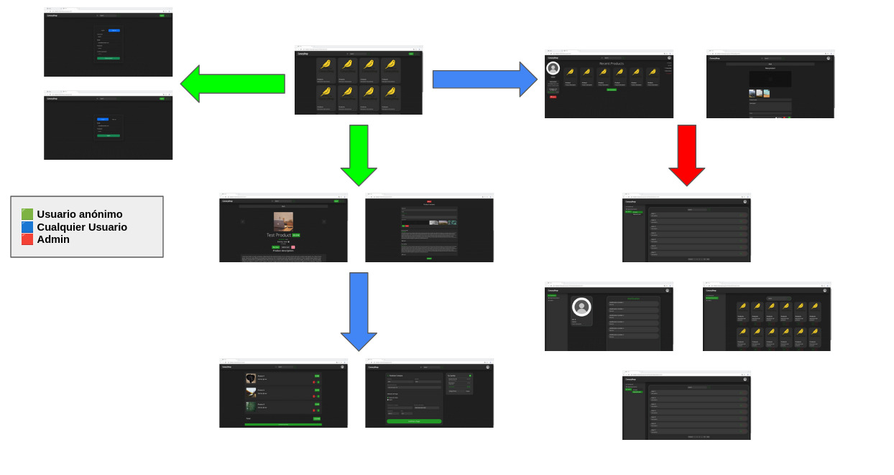

> Cualquier usuario, registrado o no, puede ver los productos en el listado y acceder a la página de cualquier producto para ver sus detalles, tanto precio como valoración y reseñas. También puede mirar los perfiles de otros usuarios, tanto de vendedores como de personas que hayan publicado reseñas. Si el usuario no tiene sesión abierta, puede iniciar sesión a través de un botón en la cabecera, o bien crear una cuenta. Con la sesión abierta, puede mirar su perfil y editarlo, y también puede subir un producto a la venta. También puede añadir productos a su carrito o comprarlos de manera directa. Si el usuario es administrador, tiene acceso al panel de admin, donde puede ver productos que han sido reportados, notificaciones de eventos y un listado de usuarios, tanto de los que han sido reportados como el listado general de usuarios

### **Capturas de Pantalla y Descripción de Páginas**

#### **1. Página Principal / Home**
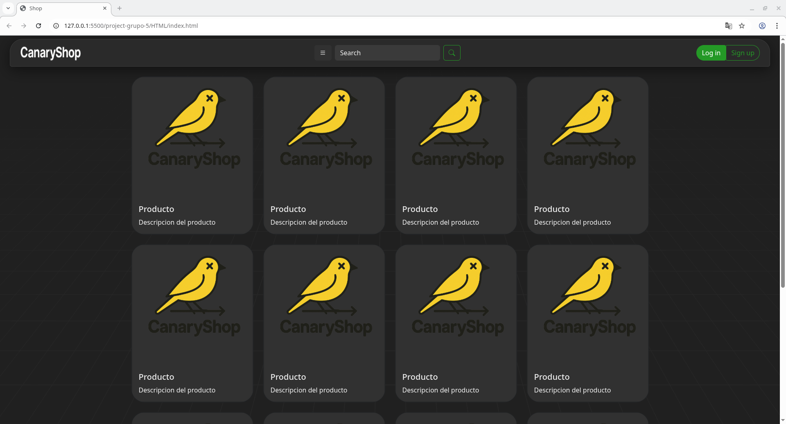

> [Descripción breve: Pantalla que aparece nada más entrar en la página se este logueado o no. Contiene los productos y una barra con el logo, una barra de busqueda para buscar productos y la foto del perfil del ususario si esta logueado o dos botones uno para iniciar sesion y otro para registrarse]

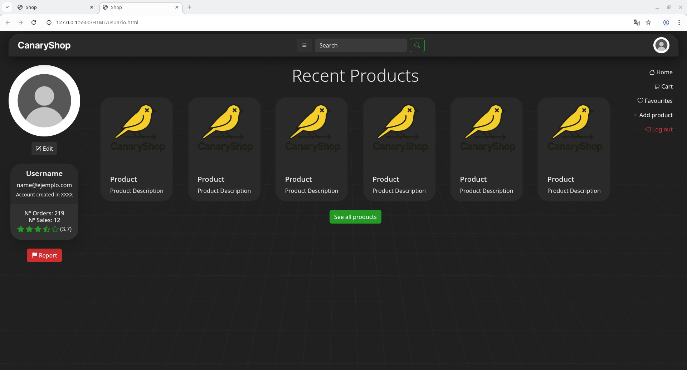

> [Descripción breve: Pantalla que aparece cuando se ve el propio perfil o el de otro usuario a diferencia la pantalla de otro usuario tiene el boton de reportar. Contiene informacion del perfil y los productos que se tienen a la venta]


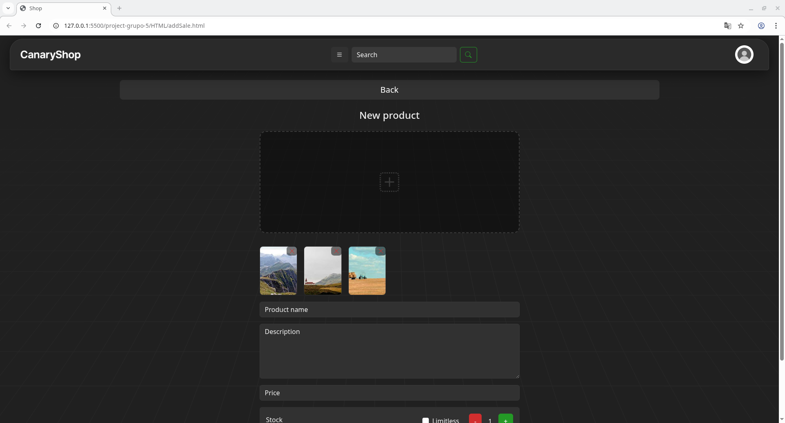

> [Descripción breve: Pantalla que aparece cuando se quiere poner algo nuevo a la venta se puede añadir fotos del producto, el nombre, el precio, una descripcion del producto y la cantidad de ese producto que se vende]

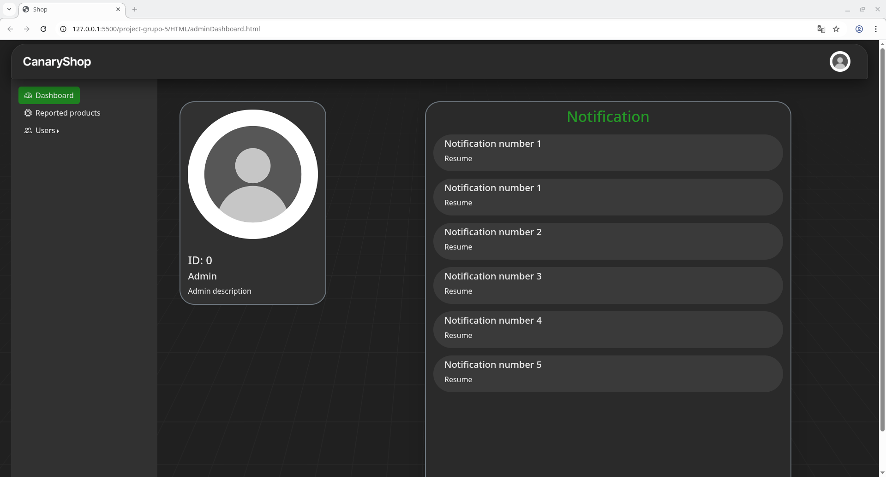

> [Descripción breve: Pantalla que aparece si se es administrador y se pulsa el botón del panel de administrador. En esta pantalla aparece la foto, la descripcion del administrador, su ID y las 5 notificaciones más recientes]

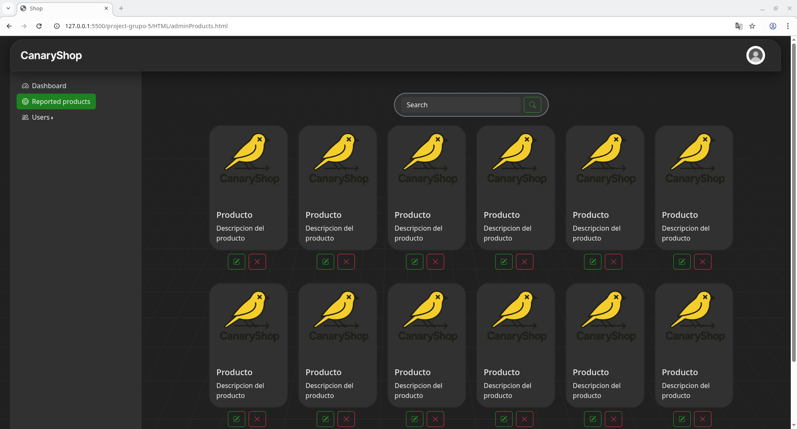

> [Descripción breve: Pantalla que aparece si se es administrador y se pulsa el botón de productos reportados. Aquí aparecen todos los productos reportados con la descripcion del reporte]

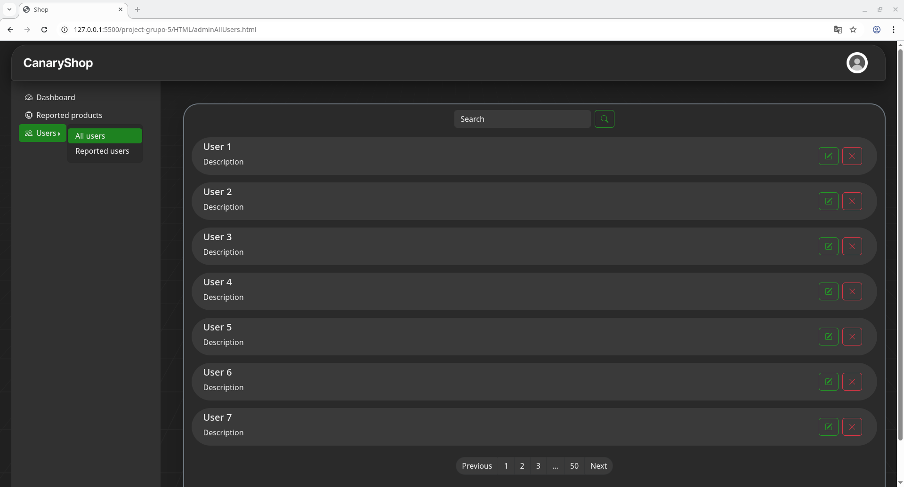

> [Descripción breve: Pantalla que aparece si se es administrador y se pulsa el botón de All Users. En esta pantalla se pueden ver todos los usuarios y editarlos o banearlos]

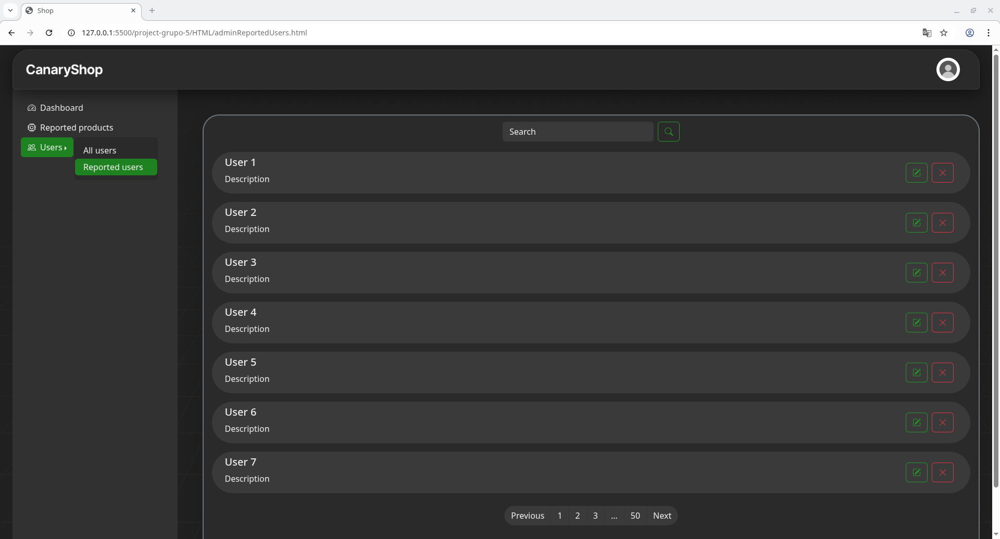

> [Descripción breve: Pantalla que aparece si se es administrador y se pulsa el botón de Reported Users. En esta pantalla se pueden ver los usuarios reportados y la descripcion del reporte se puede editar o banear los usuarios]

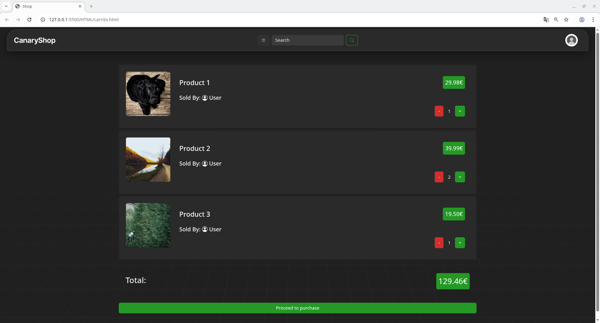

> [Descripción breve: Pantalla que aparece si se esta logueado y se pulsa el botón del carrito. Contiene los productos añadidos al carrito y un boton para proceder al pago]

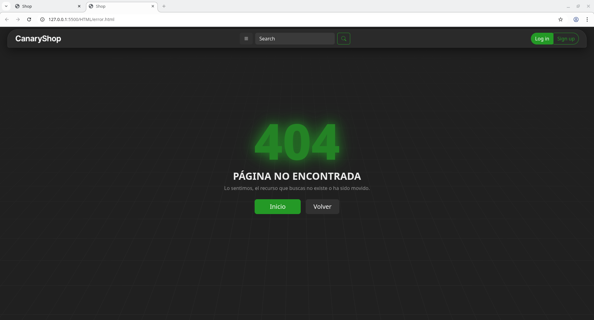

> [Descripción breve: Pantalla que aparece si ha ocurrido un error 404]

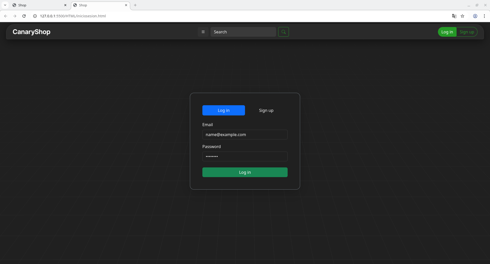

> [Descripción breve: Pantalla que aparece si se pulsa el botón de iniciar sesion]

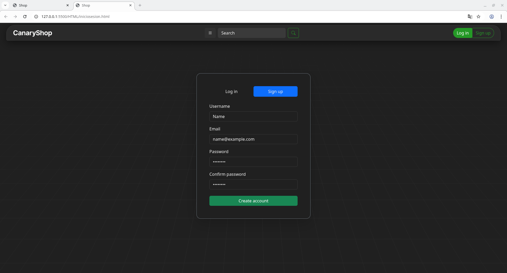

> [Descripción breve: Pantalla que aparece si se pulsa el botón de registrarse]

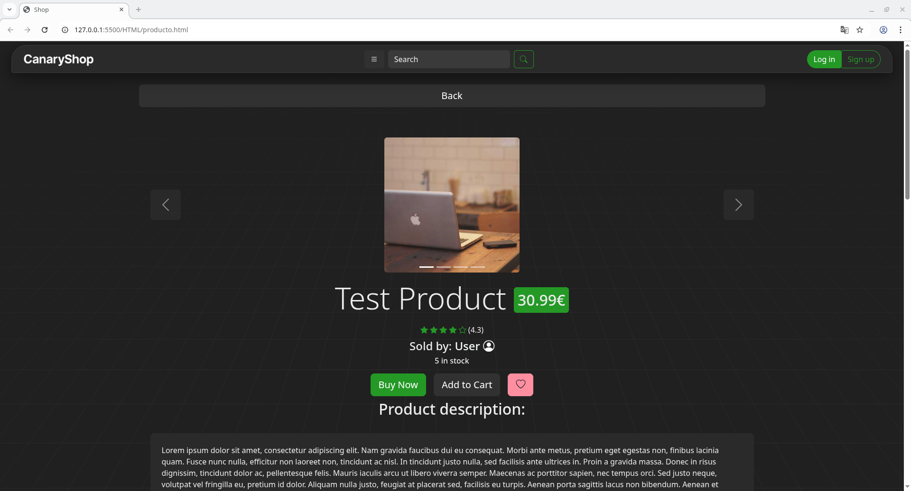
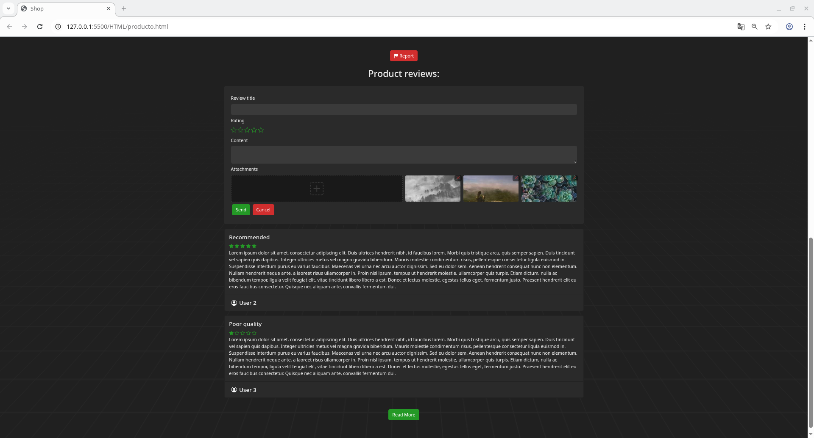

> [Descripción breve: Pantalla que aparece si se pulsa un producto. Esta pantalla contiene imagenes del producto, nombre, precio, usuario que la vende, cantidad disponible, valoraciones, tres botones uno para añadir al carrito otro para comprarlo y otro para darle a favoritos, la descripción del producto y las reseñas. Puedes reportar el producto e incluso poner reseñas si ya lo has comprado]

### **Participación de Miembros en la Práctica 1**

#### **Alumno 1 - Víctor Camarero Verdejo**

He añadido las pantallas de producto y de carrito, he creado el esquema de color de la página, he corregido errores de alineamiento en la página de usuario, he creado el menú contextual de usuarios en el panel de admin y he modificado la página de añadir productos para incluir información sobre el stock del producto a subir, entre otros cambios.

| Nº    | Commits      | Files      |
|:------------: |:------------:| :------------:|
|1| [Añadido página de producto](https://github.com/DWS-2026/project-grupo-5/commit/a1281cb7d411c4d44128fcbfeedc72a7e9f2fc50)  | [producto.html](https://github.com/DWS-2026/project-grupo-5/blob/main/HTML/producto.html)   |
|2| [Añadido página de carrito](https://github.com/DWS-2026/project-grupo-5/commit/c593693b039b8622b5f510b63fb8b9737c8d19a0)  | [carrito.html](https://github.com/DWS-2026/project-grupo-5/blob/main/HTML/carrito.html)   |
|3| [Definido tema de colores](https://github.com/DWS-2026/project-grupo-5/commit/9f194d949e857be89bd758ab82601bd1082b535a)  | [plantilla.css](https://github.com/DWS-2026/project-grupo-5/blob/main/CSS/plantilla.css)   |
|4| [Arreglado espaciado de productos del usuario](https://github.com/DWS-2026/project-grupo-5/commit/299e5f886824d60d7580604befd632993a4ed17d)  | [usuario.html](https://github.com/DWS-2026/project-grupo-5/blob/main/HTML/usuario.html)   |
|5| [Añadido selector de stock y precio en el producto](https://github.com/DWS-2026/project-grupo-5/commit/3a72c04450bbe8c59202990eb0a7864241d132ca)  | [addSale.html](https://github.com/DWS-2026/project-grupo-5/commits/main/HTML/addSale.html)   |

---

#### **Alumno 2 - Jaime Gordaliza de la Rosa**

[Descripción de las tareas y responsabilidades principales del alumno en el proyecto]

| Nº    | Commits      | Files      |
|:------------: |:------------:| :------------:|
|1| [Añadido página de inicio de sesión y registro](https://github.com/DWS-2026/project-grupo-5/commit/7d8a0b67f9ef55c68dbac8a4b52e266d060e1114)  | [iniciosesion.html]((https://github.com/DWS-2026/project-grupo-5/blob/main/CSS/iniciosesion.html.css)  |
|2| [pantalla de usuario y escalada a movil, arreglo fallo iniciosesion](https://github.com/DWS-2026/project-grupo-5/commit/2ac59f07d446f809e3b24c17afd2b50f838f45ba)  | [usuario.html](https://github.com/DWS-2026/project-grupo-5/blob/main/HTML/usuario.html)   |
|3| [admin panel boton](https://github.com/DWS-2026/project-grupo-5/commit/ed386b7ebf678661c86525054d5840c7d937f176)  | [adminDashboard.html y mas ficheros](https://github.com/DWS-2026/project-grupo-5/blob/main/HTML/adminDashboard.html)   |
|4| [Enlazados los botones de movil añadido log out en las pantallas admin y cambio de fotos entres otras cosas](https://github.com/DWS-2026/project-grupo-5/commit/5f1434036362eeb98c90c536939b0981063de34e)  | [addSale.html y mas ficheros](https://github.com/DWS-2026/project-grupo-5/blob/main/HTML/addSale.html)   |
|5| [boton de admin en movil en todas las pantallas y reajustes de faalos en el escalado a movil](https://github.com/DWS-2026/project-grupo-5/commit/e08a13eb3d410a1106f09c43afe8ed58331b8a0a)  | [adminProducts.html y más ficheros](https://github.com/DWS-2026/project-grupo-5/blob/main/HTML/adminProducts.html)   |

---

#### **Alumno 3 - [Nombre Completo]**

[Descripción de las tareas y responsabilidades principales del alumno en el proyecto]

| Nº    | Commits      | Files      |
|:------------: |:------------:| :------------:|
|1| [Descripción commit 1](URL_commit_1)  | [Archivo1](URL_archivo_1)   |
|2| [Descripción commit 2](URL_commit_2)  | [Archivo2](URL_archivo_2)   |
|3| [Descripción commit 3](URL_commit_3)  | [Archivo3](URL_archivo_3)   |
|4| [Descripción commit 4](URL_commit_4)  | [Archivo4](URL_archivo_4)   |
|5| [Descripción commit 5](URL_commit_5)  | [Archivo5](URL_archivo_5)   |

---

#### **Alumno 4 - [Nombre Completo]**

[Descripción de las tareas y responsabilidades principales del alumno en el proyecto]

| Nº    | Commits      | Files      |
|:------------: |:------------:| :------------:|
|1| [Descripción commit 1](URL_commit_1)  | [Archivo1](URL_archivo_1)   |
|2| [Descripción commit 2](URL_commit_2)  | [Archivo2](URL_archivo_2)   |
|3| [Descripción commit 3](URL_commit_3)  | [Archivo3](URL_archivo_3)   |
|4| [Descripción commit 4](URL_commit_4)  | [Archivo4](URL_archivo_4)   |
|5| [Descripción commit 5](URL_commit_5)  | [Archivo5](URL_archivo_5)   |

---

## 🛠 **Práctica 2: Web con HTML generado en servidor**

### **Vídeo de Demostración**
📹 **[Enlace al vídeo en YouTube](https://www.youtube.com/watch?v=x91MPoITQ3I)**
> Vídeo mostrando las principales funcionalidades de la aplicación web.

### **Navegación y Capturas de Pantalla**

#### **Diagrama de Navegación**

Solo si ha cambiado.

#### **Capturas de Pantalla Actualizadas**

Solo si han cambiado.

### **Instrucciones de Ejecución**

#### **Requisitos Previos**
- **Java**: versión 21 o superior
- **Maven**: versión 3.8 o superior
- **MySQL**: versión 8.0 o superior
- **Git**: para clonar el repositorio

#### **Pasos para ejecutar la aplicación**

1. **Clonar el repositorio**
   ```bash
   git clone https://github.com/[usuario]/[nombre-repositorio].git
   cd [nombre-repositorio]
   ```

2. **AQUÍ INDICAR LO SIGUIENTES PASOS**

#### **Credenciales de prueba**
- **Usuario Admin**: usuario: `admin`, contraseña: `admin`
- **Usuario Registrado**: usuario: `user`, contraseña: `user`

### **Diagrama de Entidades de Base de Datos**

Diagrama mostrando las entidades, sus campos y relaciones:


> [Descripción opcional: Ej: "El diagrama muestra las 4 entidades principales: Usuario, Producto, Pedido y Categoría, con sus respectivos atributos y relaciones 1:N y N:M."]

### **Diagrama de Clases y Templates**

Diagrama de clases de la aplicación con diferenciación por colores o secciones:

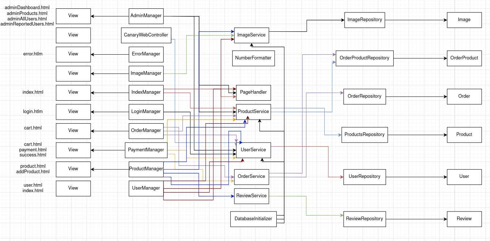

> [Descripción opcional del diagrama y relaciones principales]

### **Participación de Miembros en la Práctica 2**

#### **Alumno 1 - [Nombre Completo]**

[Descripción de las tareas y responsabilidades principales del alumno en el proyecto]

| Nº    | Commits      | Files      |
|:------------: |:------------:| :------------:|
|1| [Descripción commit 1](URL_commit_1)  | [Archivo1](URL_archivo_1)   |
|2| [Descripción commit 2](URL_commit_2)  | [Archivo2](URL_archivo_2)   |
|3| [Descripción commit 3](URL_commit_3)  | [Archivo3](URL_archivo_3)   |
|4| [Descripción commit 4](URL_commit_4)  | [Archivo4](URL_archivo_4)   |
|5| [Descripción commit 5](URL_commit_5)  | [Archivo5](URL_archivo_5)   |

---

#### **Alumno 2 - [Nombre Completo]**

[Descripción de las tareas y responsabilidades principales del alumno en el proyecto]

| Nº    | Commits      | Files      |
|:------------: |:------------:| :------------:|
|1| [Descripción commit 1](URL_commit_1)  | [Archivo1](URL_archivo_1)   |
|2| [Descripción commit 2](URL_commit_2)  | [Archivo2](URL_archivo_2)   |
|3| [Descripción commit 3](URL_commit_3)  | [Archivo3](URL_archivo_3)   |
|4| [Descripción commit 4](URL_commit_4)  | [Archivo4](URL_archivo_4)   |
|5| [Descripción commit 5](URL_commit_5)  | [Archivo5](URL_archivo_5)   |

---

#### **Alumno 3 - [Nombre Completo]**

[Descripción de las tareas y responsabilidades principales del alumno en el proyecto]

| Nº    | Commits      | Files      |
|:------------: |:------------:| :------------:|
|1| [Descripción commit 1](URL_commit_1)  | [Archivo1](URL_archivo_1)   |
|2| [Descripción commit 2](URL_commit_2)  | [Archivo2](URL_archivo_2)   |
|3| [Descripción commit 3](URL_commit_3)  | [Archivo3](URL_archivo_3)   |
|4| [Descripción commit 4](URL_commit_4)  | [Archivo4](URL_archivo_4)   |
|5| [Descripción commit 5](URL_commit_5)  | [Archivo5](URL_archivo_5)   |

---

#### **Alumno 4 - [Nombre Completo]**

[Descripción de las tareas y responsabilidades principales del alumno en el proyecto]

| Nº    | Commits      | Files      |
|:------------: |:------------:| :------------:|
|1| [Descripción commit 1](URL_commit_1)  | [Archivo1](URL_archivo_1)   |
|2| [Descripción commit 2](URL_commit_2)  | [Archivo2](URL_archivo_2)   |
|3| [Descripción commit 3](URL_commit_3)  | [Archivo3](URL_archivo_3)   |
|4| [Descripción commit 4](URL_commit_4)  | [Archivo4](URL_archivo_4)   |
|5| [Descripción commit 5](URL_commit_5)  | [Archivo5](URL_archivo_5)   |

---

## 🛠 **Práctica 3: Incorporación de una API REST a la aplicación web, análisis de vulnerabilidades y contramedidas**

### **Vídeo de Demostración**
📹 **[Enlace al vídeo en YouTube](https://www.youtube.com/watch?v=x91MPoITQ3I)**
> Vídeo mostrando las principales funcionalidades de la aplicación web.

### **Documentación de la API REST**

#### **Especificación OpenAPI**
📄 **[Especificación OpenAPI (YAML)](/api-docs/api-docs.yaml)**

#### **Documentación HTML**
📖 **[Documentación API REST (HTML)](https://raw.githack.com/[usuario]/[repositorio]/main/api-docs/api-docs.html)**

> La documentación de la API REST se encuentra en la carpeta `/api-docs` del repositorio. Se ha generado automáticamente con SpringDoc a partir de las anotaciones en el código Java.

### **Diagrama de Clases y Templates Actualizado**

Diagrama actualizado incluyendo los @RestController y su relación con los @Service compartidos:


#### **Credenciales de Usuarios de Ejemplo**

| Rol | Usuario | Contraseña |
|:---|:---|:---|
| Administrador | admin | admin123 |
| Usuario Registrado | user1 | user123 |
| Usuario Registrado | user2 | user123 |

### **Participación de Miembros en la Práctica 3**

#### **Alumno 1 - [Nombre Completo]**

[Descripción de las tareas y responsabilidades principales del alumno en el proyecto]

| Nº    | Commits      | Files      |
|:------------: |:------------:| :------------:|
|1| [Descripción commit 1](URL_commit_1)  | [Archivo1](URL_archivo_1)   |
|2| [Descripción commit 2](URL_commit_2)  | [Archivo2](URL_archivo_2)   |
|3| [Descripción commit 3](URL_commit_3)  | [Archivo3](URL_archivo_3)   |
|4| [Descripción commit 4](URL_commit_4)  | [Archivo4](URL_archivo_4)   |
|5| [Descripción commit 5](URL_commit_5)  | [Archivo5](URL_archivo_5)   |

---

#### **Alumno 2 - [Nombre Completo]**

[Descripción de las tareas y responsabilidades principales del alumno en el proyecto]

| Nº    | Commits      | Files      |
|:------------: |:------------:| :------------:|
|1| [Descripción commit 1](URL_commit_1)  | [Archivo1](URL_archivo_1)   |
|2| [Descripción commit 2](URL_commit_2)  | [Archivo2](URL_archivo_2)   |
|3| [Descripción commit 3](URL_commit_3)  | [Archivo3](URL_archivo_3)   |
|4| [Descripción commit 4](URL_commit_4)  | [Archivo4](URL_archivo_4)   |
|5| [Descripción commit 5](URL_commit_5)  | [Archivo5](URL_archivo_5)   |

---

#### **Alumno 3 - [Nombre Completo]**

[Descripción de las tareas y responsabilidades principales del alumno en el proyecto]

| Nº    | Commits      | Files      |
|:------------: |:------------:| :------------:|
|1| [Descripción commit 1](URL_commit_1)  | [Archivo1](URL_archivo_1)   |
|2| [Descripción commit 2](URL_commit_2)  | [Archivo2](URL_archivo_2)   |
|3| [Descripción commit 3](URL_commit_3)  | [Archivo3](URL_archivo_3)   |
|4| [Descripción commit 4](URL_commit_4)  | [Archivo4](URL_archivo_4)   |
|5| [Descripción commit 5](URL_commit_5)  | [Archivo5](URL_archivo_5)   |

---

#### **Alumno 4 - [Nombre Completo]**

[Descripción de las tareas y responsabilidades principales del alumno en el proyecto]

| Nº    | Commits      | Files      |
|:------------: |:------------:| :------------:|
|1| [Descripción commit 1](URL_commit_1)  | [Archivo1](URL_archivo_1)   |
|2| [Descripción commit 2](URL_commit_2)  | [Archivo2](URL_archivo_2)   |
|3| [Descripción commit 3](URL_commit_3)  | [Archivo3](URL_archivo_3)   |
|4| [Descripción commit 4](URL_commit_4)  | [Archivo4](URL_archivo_4)   |
|5| [Descripción commit 5](URL_commit_5)  | [Archivo5](URL_archivo_5)   |
