# CanaryShop

## 👥 Miembros del Equipo
| Nombre y Apellidos | Correo URJC | Usuario GitHub |
|:--- |:--- |:--- |
| Jorge Crespo Lucas | j.crespo.2024@alumnos.urjc.es | JCL625 |
| Jaime Gordaliza de la Rosa | j.gordaliza.2024@alumnos.urjc.es | jaimegordaliza64-pixel |
| Victor Camarero Verdejo | v.camarero.2024@alumnos.urjc.es | vcamarero, misperception |
| Diego Coello López | d.coello.2024@alumnos.urjc.es | dcoello4450 |

---

## 🎭 **Preparación: Definición del Proyecto**

### **Descripción del Tema**
Tienda de productos de informática en la que cada usuario puede comprar y poner en venta productos de software y hardware.
### **Entidades**
Indicar las entidades principales que gestionará la aplicación y las relaciones entre ellas:

1. **[Entidad 1]**: Usuario
2. **[Entidad 2]**: Producto
3. **[Entidad 3]**: Pedido/Carrito
4. **[Entidad 4]**: Reseña

**Relaciones entre entidades:**
- Usuario - Producto: Un usuario puede comprar un producto o venderlo
- Carrito - Producto: El carrito de un usuario tiene varios pedidos
- Carrito - Usuario: Cada usuario tiene su carrito específico 
- Usuario - Reseña: Cada usuario publica reseñas
- Producto - Reseña: Cada producto tiene varias reseñas

### **Permisos de los Usuarios**
Describir los permisos de cada tipo de usuario e indicar de qué entidades es dueño:

* **Usuario Anónimo**: 
  - Permisos: Visualización de los productos publicados, visualización de sus reseñas y registrarse
  - No es dueño de ninguna entidad

* **Usuario Registrado**: 
  - Permisos: Publicar reseñas, poner a la venta productos, comprar productos, iniciar sesión, editar su perfil y todos los permisos del usuario anónimo
  - Es dueño de: Su usuario, su carrito de la compra y sus publicaciones, tanto de sus reseñas como de sus productos

* **Administrador**: 
  - Permisos: Eliminar reseñas y productos de la pagina, añadir nuevas funcionalidades, acceder a la base de datos de usuarios y productos, banear usuarios y todos los permisos de los demás usuarios
  - Es dueño de:  Productos y publicaciones

### **Imágenes**
Indicar qué entidades tendrán asociadas una o varias imágenes:

- **[Entidad con imágenes 1]**: Usuario una imagen de perfil
- **[Entidad con imágenes 2]**: Producto Múltiples imágenes por producto
- **[Entidad con imágenes 3]**: Reseñas con multiples imagenes también

---

## 🛠 **Práctica 1: Maquetación de páginas con HTML y CSS**

### **Vídeo de Demostración**
📹 **[Enlace al vídeo en YouTube](https://youtu.be/NjZGV3qIZ20)**
> Vídeo mostrando las principales funcionalidades de la aplicación web.

### **Diagrama de Navegación**
Diagrama que muestra cómo se navega entre las diferentes páginas de la aplicación:

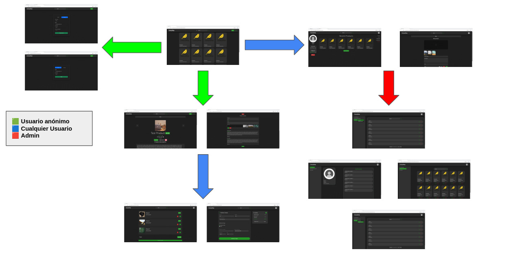

> Cualquier usuario, registrado o no, puede ver los productos en el listado y acceder a la página de cualquier producto para ver sus detalles, tanto precio como valoración y reseñas. También puede mirar los perfiles de otros usuarios, tanto de vendedores como de personas que hayan publicado reseñas. Si el usuario no tiene sesión abierta, puede iniciar sesión a través de un botón en la cabecera, o bien crear una cuenta. Con la sesión abierta, puede mirar su perfil y editarlo, y también puede subir un producto a la venta. También puede añadir productos a su carrito o comprarlos de manera directa. Si el usuario es administrador, tiene acceso al panel de admin, donde puede ver productos que han sido reportados, notificaciones de eventos y un listado de usuarios, tanto de los que han sido reportados como el listado general de usuarios

### **Capturas de Pantalla y Descripción de Páginas**

#### **1. Página Principal / Home**
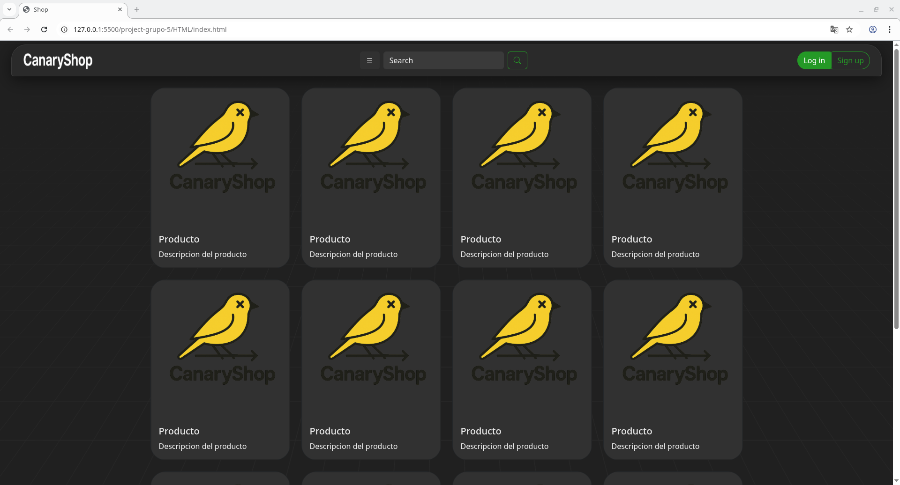

> [Descripción breve: Pantalla que aparece nada más entrar en la página se este logueado o no. Contiene los productos y una barra con el logo, una barra de busqueda para buscar productos y la foto del perfil del ususario si esta logueado o dos botones uno para iniciar sesion y otro para registrarse]

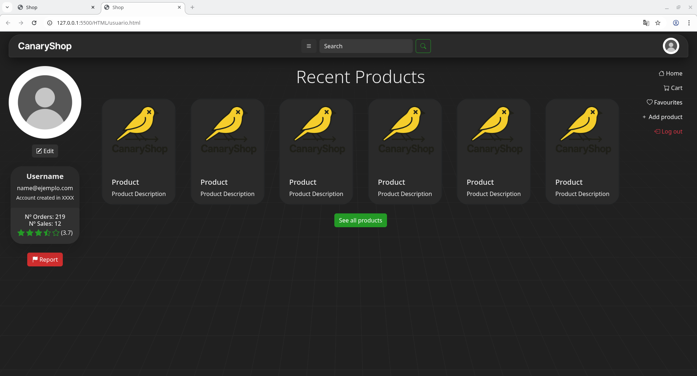

> [Descripción breve: Pantalla que aparece cuando se ve el propio perfil o el de otro usuario a diferencia la pantalla de otro usuario tiene el boton de reportar. Contiene informacion del perfil y los productos que se tienen a la venta]

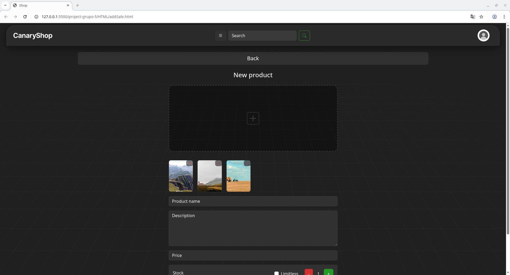

> [Descripción breve: Pantalla que aparece cuando se quiere poner algo nuevo a la venta se puede añadir fotos del producto, el nombre, el precio, una descripcion del producto y la cantidad de ese producto que se vende]

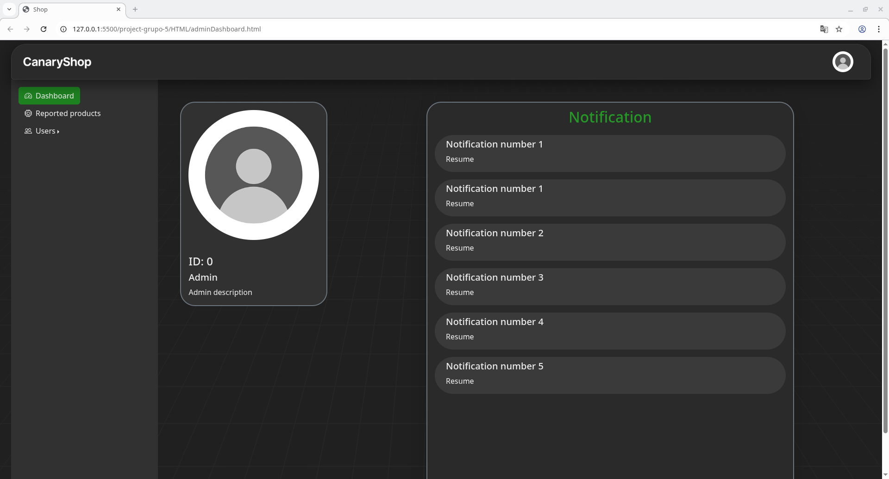

> [Descripción breve: Pantalla que aparece si se es administrador y se pulsa el botón del panel de administrador. En esta pantalla aparece la foto, la descripcion del administrador, su ID y las 5 notificaciones más recientes]

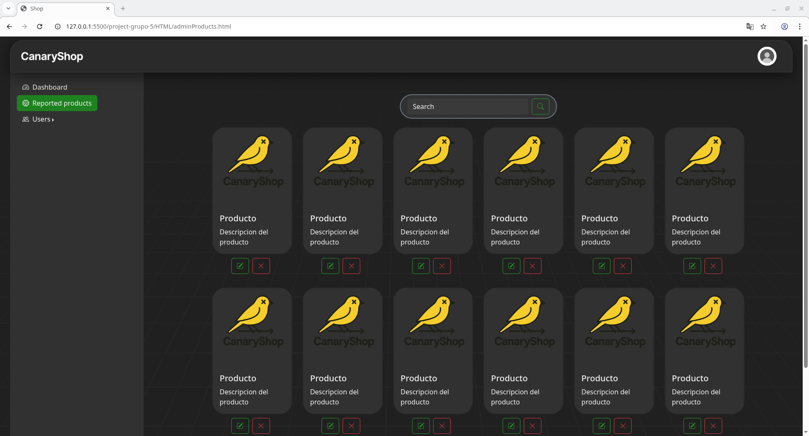

> [Descripción breve: Pantalla que aparece si se es administrador y se pulsa el botón de productos reportados. Aquí aparecen todos los productos reportados con la descripcion del reporte]

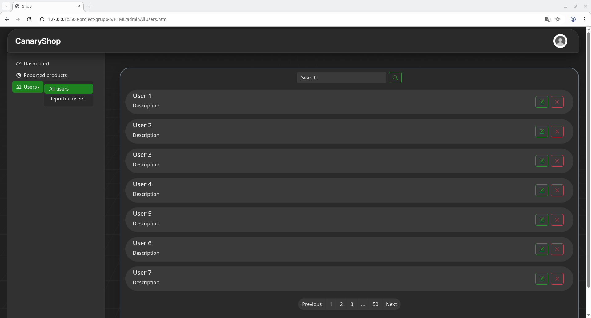

> [Descripción breve: Pantalla que aparece si se es administrador y se pulsa el botón de All Users. En esta pantalla se pueden ver todos los usuarios y editarlos o banearlos]

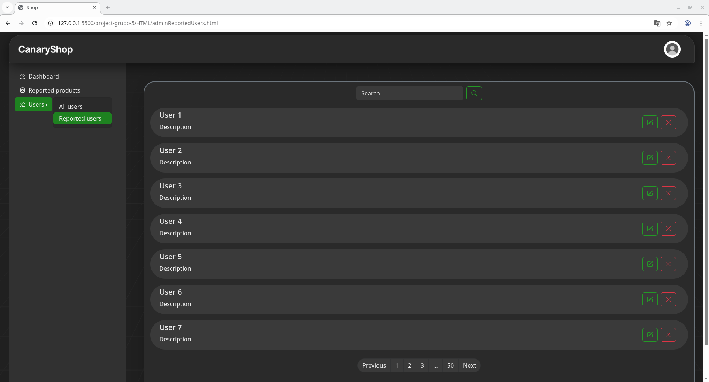

> [Descripción breve: Pantalla que aparece si se es administrador y se pulsa el botón de Reported Users. En esta pantalla se pueden ver los usuarios reportados y la descripcion del reporte se puede editar o banear los usuarios]

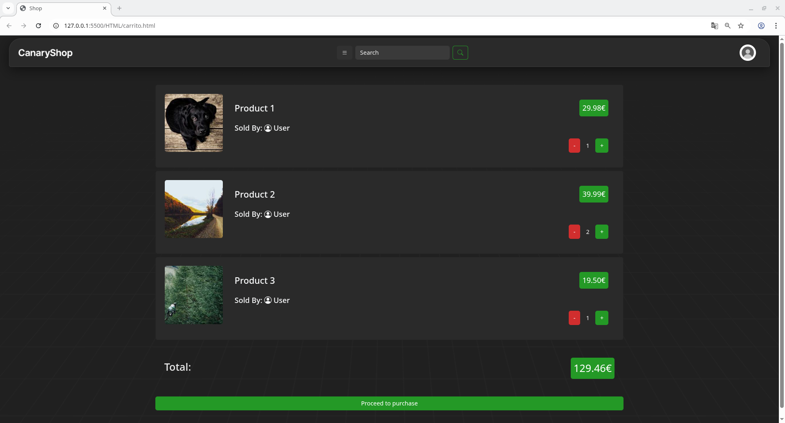

> [Descripción breve: Pantalla que aparece si se esta logueado y se pulsa el botón del carrito. Contiene los productos añadidos al carrito y un boton para proceder al pago]

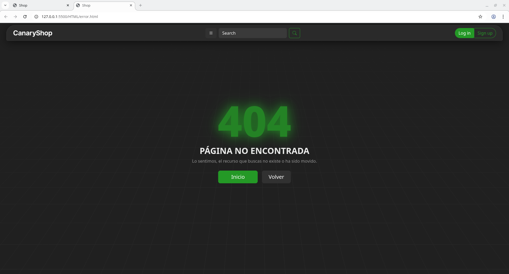

> [Descripción breve: Pantalla que aparece si ha ocurrido un error 404]

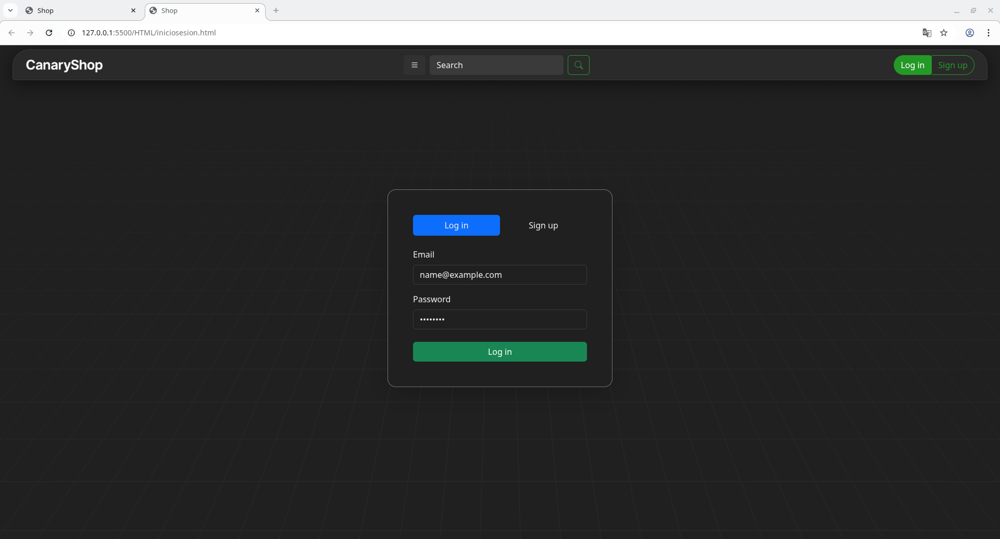

> [Descripción breve: Pantalla que aparece si se pulsa el botón de iniciar sesion]

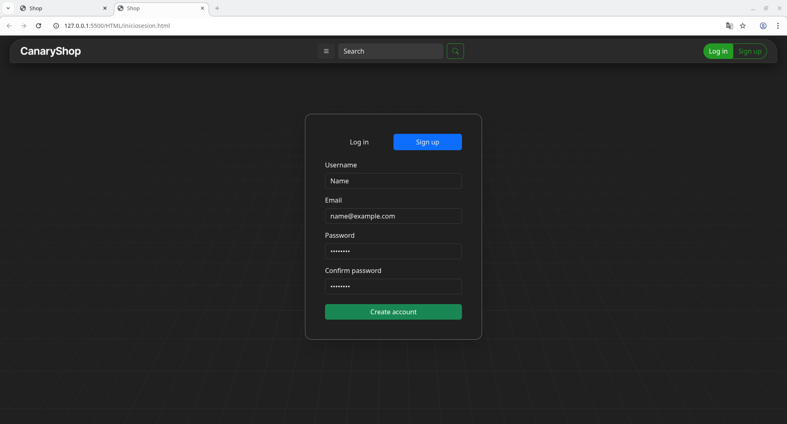

> [Descripción breve: Pantalla que aparece si se pulsa el botón de registrarse]

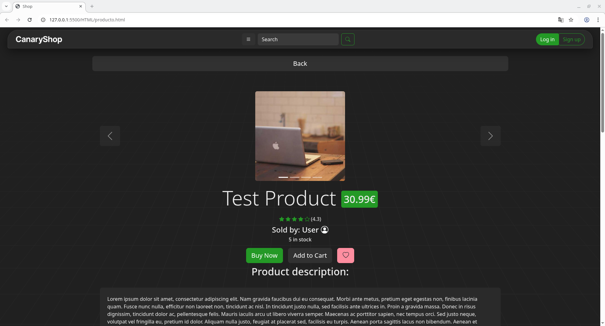
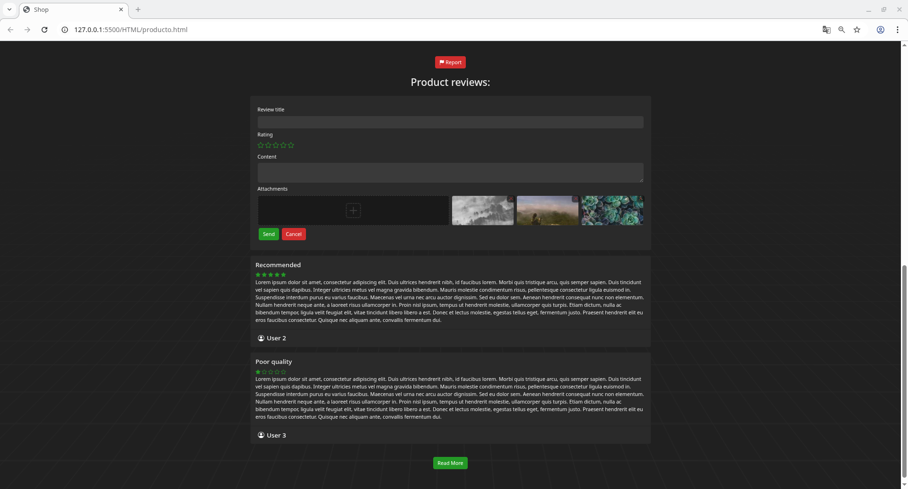

> [Descripción breve: Pantalla que aparece si se pulsa un producto. Esta pantalla contiene imagenes del producto, nombre, precio, usuario que la vende, cantidad disponible, valoraciones, tres botones uno para añadir al carrito otro para comprarlo y otro para darle a favoritos, la descripción del producto y las reseñas. Puedes reportar el producto e incluso poner reseñas si ya lo has comprado]

### **Participación de Miembros en la Práctica 1**

#### **Alumno 1 - Víctor Camarero Verdejo**

He añadido las pantallas de producto y de carrito, he creado el esquema de color de la página, he corregido errores de alineamiento en la página de usuario, he creado el menú contextual de usuarios en el panel de admin y he modificado la página de añadir productos para incluir información sobre el stock del producto a subir, entre otros cambios.

| Nº    | Commits      | Files      |
|:------------: |:------------:| :------------:|
|1| [Añadido página de producto](https://github.com/DWS-2026/project-grupo-5/commit/a1281cb7d411c4d44128fcbfeedc72a7e9f2fc50)  | [producto.html](https://github.com/DWS-2026/project-grupo-5/blob/main/HTML/producto.html)   |
|2| [Añadido página de carrito](https://github.com/DWS-2026/project-grupo-5/commit/c593693b039b8622b5f510b63fb8b9737c8d19a0)  | [carrito.html](https://github.com/DWS-2026/project-grupo-5/blob/main/HTML/carrito.html)   |
|3| [Definido tema de colores](https://github.com/DWS-2026/project-grupo-5/commit/9f194d949e857be89bd758ab82601bd1082b535a)  | [plantilla.css](https://github.com/DWS-2026/project-grupo-5/blob/main/CSS/plantilla.css)   |
|4| [Arreglado espaciado de productos del usuario](https://github.com/DWS-2026/project-grupo-5/commit/299e5f886824d60d7580604befd632993a4ed17d)  | [usuario.html](https://github.com/DWS-2026/project-grupo-5/blob/main/HTML/usuario.html)   |
|5| [Añadido selector de stock y precio en el producto](https://github.com/DWS-2026/project-grupo-5/commit/3a72c04450bbe8c59202990eb0a7864241d132ca)  | [addSale.html](https://github.com/DWS-2026/project-grupo-5/commits/main/HTML/addSale.html)   |

---

#### **Alumno 2 - Jaime Gordaliza de la Rosa**

He añadido las pantallas de inicio de sesion y registro además de realizar numerosos ajustes y correccion de errores en todas las pantallas, he enlazado la mayoria de pantallas entre si y además de escalar a movil todo lo que he realizado. He añadido también los botones de admin y de enlace entre paginas que tambien están escalados a movil, entre otras cosas.

| Nº    | Commits      | Files      |
|:------------: |:------------:| :------------:|
|1| [Añadido página de inicio de sesión y registro](https://github.com/DWS-2026/project-grupo-5/commit/7d8a0b67f9ef55c68dbac8a4b52e266d060e1114)  | [iniciosesion.html](https://github.com/DWS-2026/project-grupo-5/blob/main/CSS/iniciosesion.html.css)  |
|2| [pantalla de usuario y escalada a movil, arreglo fallo iniciosesion](https://github.com/DWS-2026/project-grupo-5/commit/2ac59f07d446f809e3b24c17afd2b50f838f45ba)  | [usuario.html](https://github.com/DWS-2026/project-grupo-5/blob/main/HTML/usuario.html)   |
|3| [admin panel boton](https://github.com/DWS-2026/project-grupo-5/commit/ed386b7ebf678661c86525054d5840c7d937f176)  | [adminDashboard.html](https://github.com/DWS-2026/project-grupo-5/blob/main/HTML/adminDashboard.html)   |
|4| [Enlazados los botones de movil añadido log out en las pantallas admin y cambio de fotos entres otras cosas](https://github.com/DWS-2026/project-grupo-5/commit/5f1434036362eeb98c90c536939b0981063de34e)  | [addSale.html](https://github.com/DWS-2026/project-grupo-5/blob/main/HTML/addSale.html)   |
|5| [boton de admin en movil en todas las pantallas y reajustes de faalos en el escalado a movil](https://github.com/DWS-2026/project-grupo-5/commit/e08a13eb3d410a1106f09c43afe8ed58331b8a0a)  | [adminProducts.html](https://github.com/DWS-2026/project-grupo-5/blob/main/HTML/adminProducts.html)   |

---

#### **Alumno 3 - Jorge Crespo Lucas**

He añádido la pantalla del menu principal donde visualizar todos los productos. También he añadido la pantalla de poner producto a la venta o de editarlo. Y por ultimo he añadido las pantallas del menu de administración junto con la de productos reportados y usuarios reportados. Hice que la plantilla se escalase correctamente a movil. 

| Nº    | Commits      | Files      |
|:------------: |:------------:| :------------:|
|1| [Añadida la página de todos los productos](https://github.com/DWS-2026/dws-2026-project-base/commit/f4c2db19d3db22418db1cbf79ef9691045d11a05)  | [index.html](https://github.com/DWS-2026/project-grupo-5/blob/main/HTML/index.html)   |
|2| [Añadida la página de crear un producto o de editarlo](https://github.com/DWS-2026/dws-2026-project-base/commit/651bbf15e7e98ec73eed2463ddf5993d4f10ca68)  | [addSale.html](https://github.com/DWS-2026/project-grupo-5/blob/main/HTML/addSale.html)   |
|3| [Termine las pantallas de administración del panel principal la de usuarios y productos reportados](https://github.com/DWS-2026/dws-2026-project-base/commit/12af24d767c019d41083efda19d09859ac92cfbe)  | [adminReportedUsers](https://github.com/DWS-2026/project-grupo-5/blob/main/HTML/adminReportedUsers.html)  |
|4| [Escale la plantilla general a movil](https://github.com/DWS-2026/dws-2026-project-base/commit/4c8df3edfe3affa129659c3e760cd46156140705#diff-be7b3a1c52a0be1a659a45281dd6563627565b4a585f11c730b2bd019eca9117)  | [plantilla.html](https://github.com/DWS-2026/project-grupo-5/blob/main/HTML/plantilla.html)   |
|5| [Pantallas de panel de administracion y de productos](https://github.com/DWS-2026/dws-2026-project-base/commit/bc3e1362caca818119aa6043d0c8b10d5427bb53)  | [adminDashboard.html](https://github.com/DWS-2026/project-grupo-5/blob/main/HTML/adminDashboard.html)   |

---

#### **Alumno 4 - Diego Coello López**

He contribuido al diseño principal de la página web creando el fondo dínamico que está presente en todas las páginas. También he añadido las pantallas de pago y la de error. Y por último, he corregido alguno que otro error y he enlazado algunos botones con sus htmls correspondientes.

| Nº    |                                                                                              Commits                                                                                               |                                                                                                                                                                                  Files                                                                                                                                                                   |
|:------------: |:--------------------------------------------------------------------------------------------------------------------------------------------------------------------------------------------------:|:--------------------------------------------------------------------------------------------------------------------------------------------------------------------------------------------------------------------------------------------------------------------------------------------------------------------------------------------------------:|
|1| [He mejorado el diseño de la página añadiendo un fondo dinámico y poniendo sombras a la barra.](https://github.com/DWS-2026/dws-2026-project-base/commit/3955bf4d46a359024b34b4e51ba877eb37f3c08d) |                                                                                               [index.html](https://github.com/DWS-2026/project-grupo-5/blob/main/HTML/index.html) [plantilla.css](https://github.com/DWS-2026/project-grupo-5/blob/main/CSS/plantilla.css)                                                                               |
|2|                                   [He enlazado las páginas.](https://github.com/DWS-2026/dws-2026-project-base/commit/bf3e82ddf8189db6e5ab51950aa257b713e0fae4)                                    | [index.html](https://github.com/DWS-2026/project-grupo-5/blob/main/HTML/index.html) [plantilla.css](https://github.com/DWS-2026/project-grupo-5/blob/main/CSS/plantilla.css) [iniciosesion.html](https://github.com/DWS-2026/project-grupo-5/blob/main/HTML/iniciosesion.html) [producto.html](https://github.com/DWS-2026/project-grupo-5/blob/main/HTML/producto.html) |
|3|                    [Página de pago y de errores. De momento solo la de 404](https://github.com/DWS-2026/dws-2026-project-base/commit/646af98793dd6d668ba691b88b2e344f131cc0ea)                     |          [error.html](https://github.com/DWS-2026/project-grupo-5/blob/main/HTML/error.html) [payment.html](https://github.com/DWS-2026/project-grupo-5/blob/main/HTML/payment.html) [plantilla.css](https://github.com/DWS-2026/project-grupo-5/blob/main/CSS/plantilla.css) [error.css](https://github.com/DWS-2026/project-grupo-5/blob/main/CSS/error.css) |
|4|                                     [Corrección de errores](https://github.com/DWS-2026/dws-2026-project-base/commit/95a665ded8b23e7b8e6cadf491bf6057ee1d8444)                                     |                                                                                                                                          [Todos los archivos HTML](https://github.com/DWS-2026/project-grupo-5/tree/main/HTML)                                                                                                                           |

---

## 🛠 **Práctica 2: Web con HTML generado en servidor**

### **Vídeo de Demostración**
📹 **[Enlace al vídeo en YouTube](https://youtu.be/Xz2eyGq3pRs)**
> Vídeo mostrando las principales funcionalidades de la aplicación web.

### **Navegación y Capturas de Pantalla**

#### **Diagrama de Navegación**

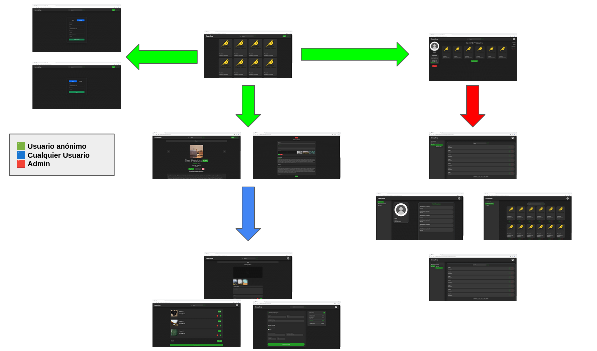

#### **Capturas de Pantalla Actualizadas**
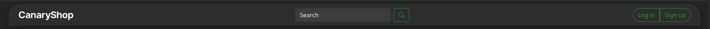
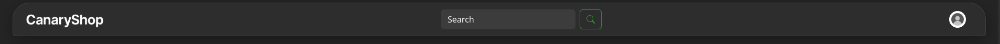

> [Descripción breve: Hemos cambiado un poco la cabecera]

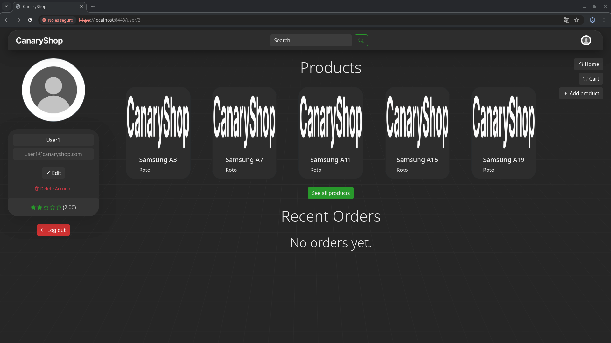

> [Descripción breve: Hemos añadido botones de deslogearse y para editar el perfil ademas de que puede ver todos los pedidos que ha hecho]

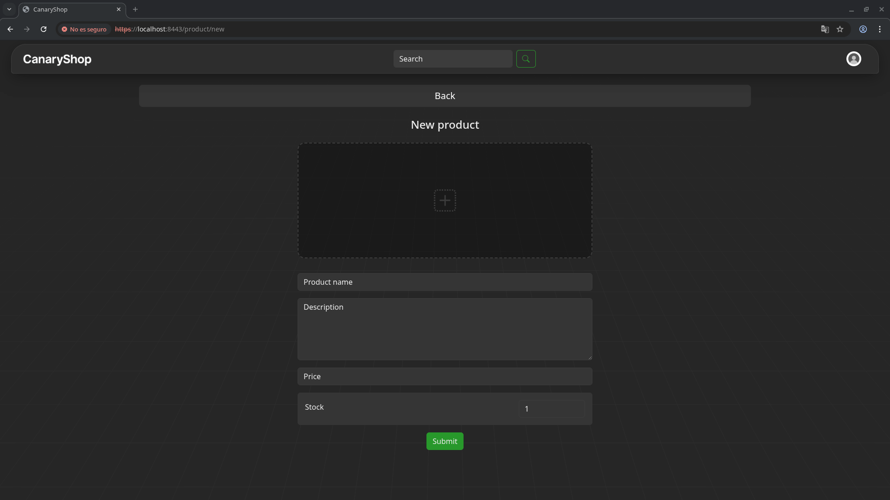

> [Descripción breve: hemos cambiado ligeramente esta pantalla no hay X encima de las imagenes]

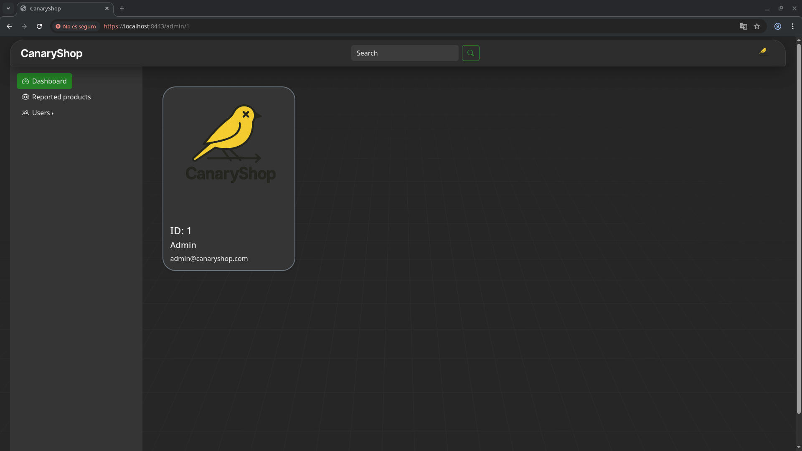

> [Descripción breve: Ya no hay notificaciones]

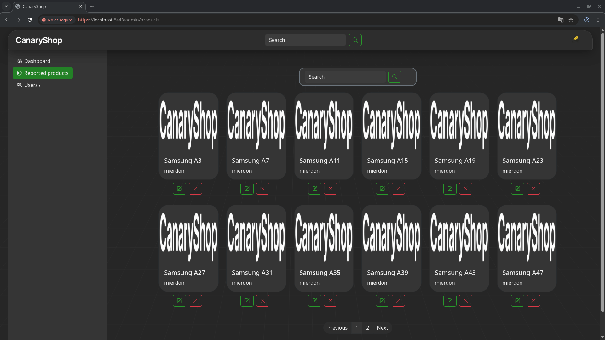

> [Descripción breve: Se ha cambiado ligeramente]

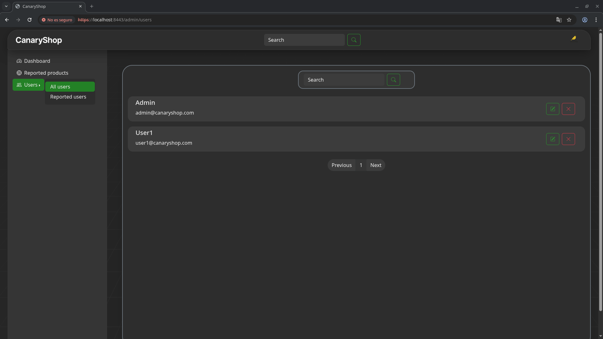

> [Descripción breve:se ha cambiado ligeramente]

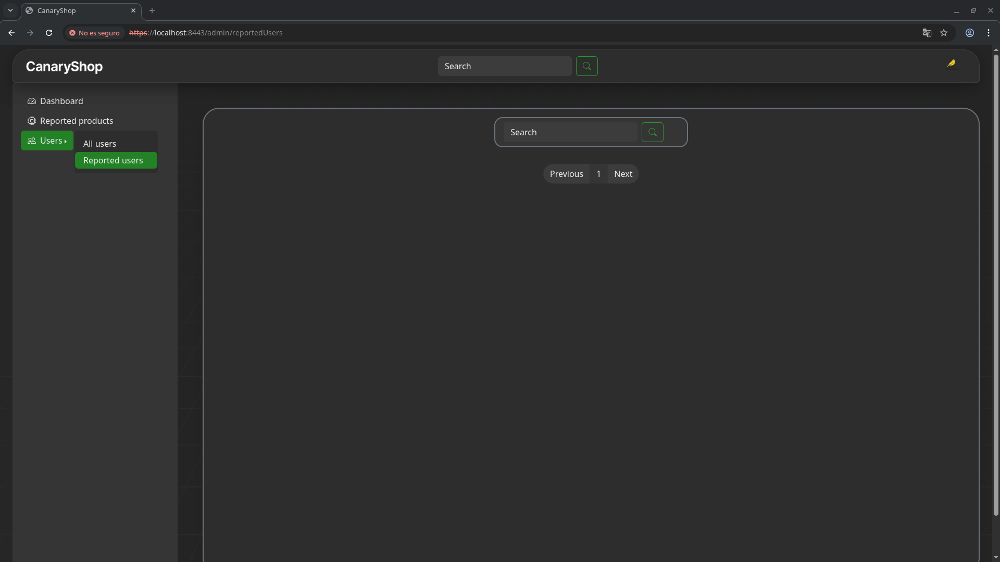

> [Descripción breve: se ha cambiado ligeramente]

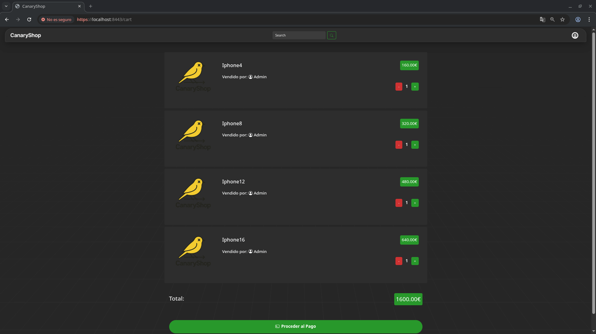


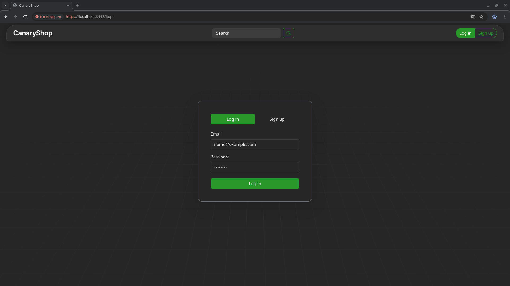

> [Descripción breve: Pantalla que aparece si se pulsa el botón de iniciar sesion]

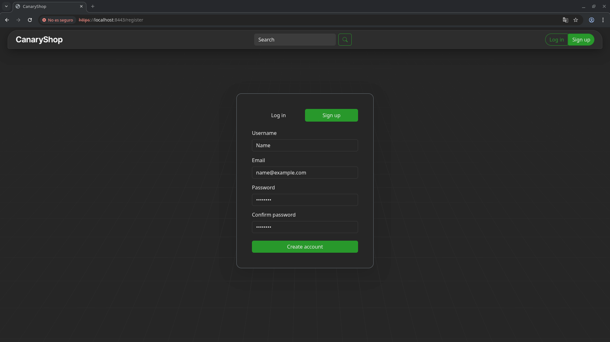

> [Descripción breve: Pantalla que aparece si se pulsa el botón de registrarse]

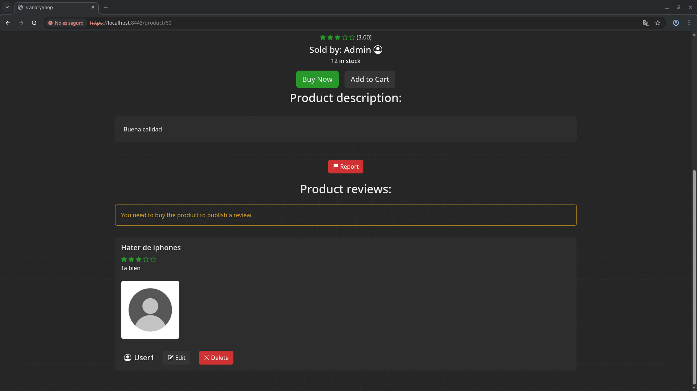
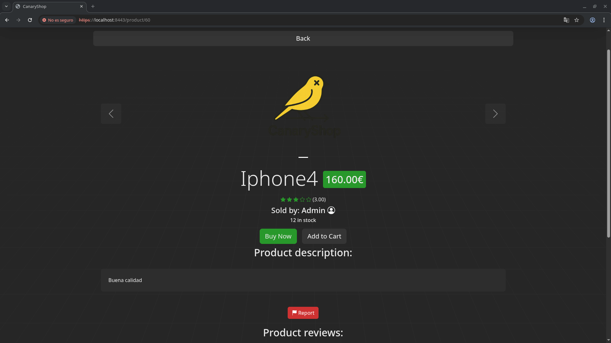

> [Descripción breve: Se ha cambiado ligeramente]

### **Instrucciones de Ejecución**

#### **Requisitos Previos**
- **Java**: versión 21 o superior
- **Maven**: versión 3.8 o superior
- **MySQL**: versión 8.0 o superior
- **Git**: para clonar el repositorio

#### **Pasos para ejecutar la aplicación**

1. **Clonar el repositorio**
   ```bash
   git clone https://github.com/DWS-2026/project-grupo-5.git
   cd project-grupo-5
   ```

2. **Iniciamos la Base de Datos**
    ```bash
    docker run --rm -e MYSQL_ROOT_PASSWORD=password \
    -e MYSQL_DATABASE=canaryshop -p 3306:3306 -d mysql:9.6.0
    ```

3. **Iniciamos el servidor**
    - Por terminal:
      ```bash
      ./mvnw spring-boot:run
      ```
    - Desde un IDE, iniciamos el proyecto.


#### **Credenciales de prueba**
- **Usuario Admin**: usuario: `admin@canaryshop.com`, contraseña: `admin`
- **Usuario Registrado**: usuario: `user1@canaryshop.com`, contraseña: `user1`

### **Diagrama de Entidades de Base de Datos**

Diagrama mostrando las entidades, sus campos y relaciones:

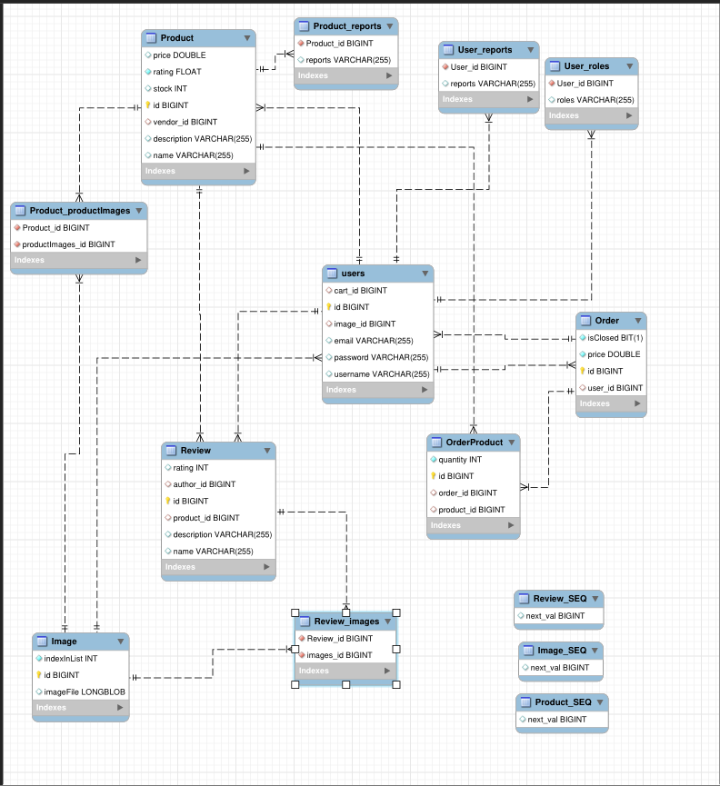

### **Diagrama de Clases y Templates**

Diagrama de clases de la aplicación con diferenciación por colores o secciones:

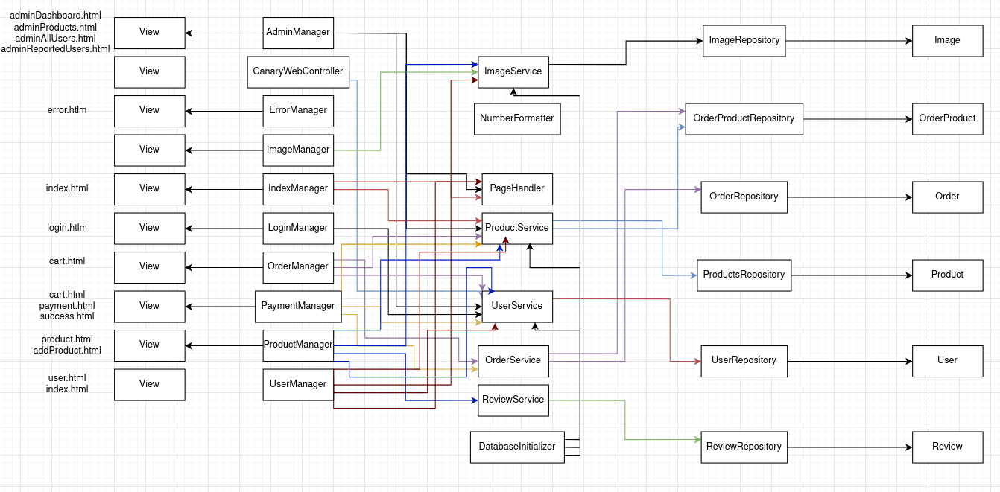

### **Participación de Miembros en la Práctica 2**

#### **Alumno 1 - Diego Coello López**

He creado la base de la aplicación web, instalando springboot, la base de datos y organizando todos los archivos. También he implementado el login, el register de usuarios, la pantalla de pago, la redirección a pantallas de error y la corrección de errores y bugs.

| Nº    | Commits      | Files      |
|:------------: |:------------:| :------------:|
|1| [Página web funcional + página de error funcional + todos los href="" actualizados](https://github.com/DWS-2026/project-grupo-5/commit/21a320b35e887b4d2c920744c3a8015193a6666f)  | [ErrorManage.java](https://github.com/DWS-2026/project-grupo-5/commit/21a320b35e887b4d2c920744c3a8015193a6666f#diff-0cb5491de56a89658a7e7cb8acb2e6dcf1148c19a15928a9b9661edb552a2746), [IndexManage.java](https://github.com/DWS-2026/project-grupo-5/commit/21a320b35e887b4d2c920744c3a8015193a6666f#diff-969bce264c621ee3b2139ad9897c7bc873997cd8f2d9ed5d32c436e31722b742), [Todos los html](https://github.com/DWS-2026/project-grupo-5/commit/21a320b35e887b4d2c920744c3a8015193a6666f)  |
|2| [Base De Datos](https://github.com/DWS-2026/project-grupo-5/commit/457a7add56ab77ab243af340c229049296914695)  | [pom.xml](https://github.com/DWS-2026/project-grupo-5/commit/457a7add56ab77ab243af340c229049296914695#diff-9c5fb3d1b7e3b0f54bc5c4182965c4fe1f9023d449017cece3005d3f90e8e4d8), [User.java](https://github.com/DWS-2026/project-grupo-5/commit/457a7add56ab77ab243af340c229049296914695#diff-3387b6c8a6d59c801d179e79e78e70a8f3c0ad6bc2becd4ec19fb4eaa4784d7f)   |
|3| [Botón de borrar usuarios](https://github.com/DWS-2026/project-grupo-5/commit/572048ffb1ef653c65eb8e1712c4ba19ed8bf192)  | [UserManager.java](https://github.com/DWS-2026/project-grupo-5/commit/572048ffb1ef653c65eb8e1712c4ba19ed8bf192#diff-2bf61f7e9b546b14d9a503b40b96e95b739a19a60acbe4bfd6f4508f1a462e82), [UserService.java](https://github.com/DWS-2026/project-grupo-5/commit/572048ffb1ef653c65eb8e1712c4ba19ed8bf192#diff-ce904d24cf719cc3a450967ab8accef2b14fd8a7afb06b46653b6c45455c619c), [user.html](https://github.com/DWS-2026/project-grupo-5/commit/572048ffb1ef653c65eb8e1712c4ba19ed8bf192#diff-432f1ee3cfc65d2d49142cf3ebdeee2ae3defaf362beb8532177caaae1818de8)   |
|4| [Pantalla de pago](https://github.com/DWS-2026/project-grupo-5/commit/7a03d648c0bf069b404901de81f4879ef5c8be23)  | [SecurityConfiguration.java](https://github.com/DWS-2026/project-grupo-5/commit/7a03d648c0bf069b404901de81f4879ef5c8be23#diff-58270c08a0235d2119529cf41788646dcd58993a434af875d17d5fb9df64a8b2), [PaymentManager.java](https://github.com/DWS-2026/project-grupo-5/commit/7a03d648c0bf069b404901de81f4879ef5c8be23#diff-3ac3ae92f0eca3a24472bf1f5c53bbb98a94ac822b4abb11adec78e90b917747), [payment.java](https://github.com/DWS-2026/project-grupo-5/commit/7a03d648c0bf069b404901de81f4879ef5c8be23#diff-59e0afc8b812c798df8d7b6b47b8279587eeed7b8aac6a228afe55ab8de397c1)   |
|5| [Pantalla de success arreglado](https://github.com/DWS-2026/project-grupo-5/commit/1e73e6275ea265ef1cda547d64afbc90af55149e)  | [PaymentManager.java](https://github.com/DWS-2026/project-grupo-5/commit/1e73e6275ea265ef1cda547d64afbc90af55149e#diff-3ac3ae92f0eca3a24472bf1f5c53bbb98a94ac822b4abb11adec78e90b917747), [payment.java](https://github.com/DWS-2026/project-grupo-5/commit/1e73e6275ea265ef1cda547d64afbc90af55149e#diff-59e0afc8b812c798df8d7b6b47b8279587eeed7b8aac6a228afe55ab8de397c1), [success.java](https://github.com/DWS-2026/project-grupo-5/commit/1e73e6275ea265ef1cda547d64afbc90af55149e#diff-1af117a83d204603dfe133ec765d0e2be02e4e5399add9637d6cc735fda84506)   |

---

#### **Alumno 2 - Jaime Gordaliza de la Rosa**

He arreglado errores tanto de la practica 1 como de la actual ademas he creado el carrito de compra, las orders y los reportes.
| Nº    | Commits      | Files      |
|:------------: |:------------:| :------------:|
|1| [Corrección de los fallos de la práctica 1](https://github.com/DWS-2026/project-grupo-5/commit/81fe0519a749f1e4f38de40c9228ac3aaa4545e6)  | [usuario.html](src/main/resources/templates/usuario.html)   |
|2| [Creación Cart manager](https://github.com/DWS-2026/project-grupo-5/commit/ce9c8b5e59e1b4618d9c35b11e50e184b07d2696)  | [CartManager(OrderManager)](src/main/java/com/canaryshop/canaryshop/controllers/CartManager.java)   |
|3| [Mejora del carrito](https://github.com/DWS-2026/project-grupo-5/commit/0a6f3adf6b520f69fb93dbc0e24ff9f26baa3115)  | [CartManager(OrderManager)](src/main/java/com/canaryshop/canaryshop/controllers/CartManager.java)   |
|4| [Reporte de usuarios](https://github.com/DWS-2026/project-grupo-5/commit/2f99bf0db5721bb4527f07f8fad421fbc5b65a0d)  | [UserManager.java](src/main/java/com/canaryshop/canaryshop/controllers/UserManager.java)   |
|5| [Reporte de usuarios](https://github.com/DWS-2026/project-grupo-5/commit/8b3864b7e26f7d861449fc0b9f5c850e585303a3)  | [ProductManager.java](src/main/java/com/canaryshop/canaryshop/controllers/ProductManager.java)   |

---

#### **Alumno 3 - Jorge Crespo Lucas**

He creado la parte del administrador y la pagina del indice junto con la busqueda de la cabecera y la forma de guardar imagenes en la base de datos.

| Nº    | Commits      | Files      |
|:------------: |:------------:| :------------:|
|1| [La parte de productos reportados y el dashboard de administrador](https://github.com/DWS-2026/project-grupo-5/commit/0bad653de426debc9e9c8f310d2e9659210d7f0b)  | [AdmninManager.java](src/main/java/com/canaryshop/canaryshop/controllers/AdminManager.java) [adminProducts.html](src/main/resources/templates/adminProducts.html)  |
|2| [Pagina de ver todos los usuarios en el panel de administrador hecha](https://github.com/DWS-2026/project-grupo-5/commit/d16a16af765a26d6371abb0306b237a51e5621cf)  | [AdminManager.java](src/main/java/com/canaryshop/canaryshop/controllers/AdminManager.java) [adminAllUser.html](src/main/resources/templates/adminAllUsers.html)  |
|3| [Los usuarios reportados para verlos en el panel de administrador](https://github.com/DWS-2026/project-grupo-5/commit/e6b1aba83d6dde7b511597a0cea96d1d4de49cad)  | [AdminManager.java](src/main/java/com/canaryshop/canaryshop/controllers/AdminManager.java) [adminReportedUsers.html](src/main/resources/templates/adminReportedUsers.html) [UserRepository.java](src/main/java/com/canaryshop/canaryshop/repositories/UserRepository.java) |
|4| [Teniamos muchos errores al borrar usuarios que arregle](https://github.com/DWS-2026/project-grupo-5/commit/3fc16e63972ed523ff169cce38de0993f4939ed2)  | [UserManager.java](src/main/java/com/canaryshop/canaryshop/controllers/UserManager.java) [UserService.java](src/main/java/com/canaryshop/canaryshop/services/UserService.java)  |
|5| [Imagenes guardadas en base de datos a un tamaño fijo y en .png](https://github.com/DWS-2026/project-grupo-5/commit/6bda25a8b39561d6969ec69e6315edeb54a2fd77)  | [ImageService.java](src/main/java/com/canaryshop/canaryshop/services/ImageService.java)   |

---

#### **Alumno 4 - Víctor Camarero Verdejo**

He desarrollado las entidades de producto y reseña y sus páginas, he ayudado con la entidad de pedido y he implementado la subida de imágenes a base de datos. También he añadido el token CSRF a todos los formularios de la página y he implementado HTTPS.

| Nº    |                                                                  Commits                                                                   |                                                                                                                                                                                                                                                                                                                                                                            Files                                                                                                                                                                                                                                                                                                                                                                            |
|:------------: |:------------------------------------------------------------------------------------------------------------------------------------------:|:-----------------------------------------------------------------------------------------------------------------------------------------------------------------------------------------------------------------------------------------------------------------------------------------------------------------------------------------------------------------------------------------------------------------------------------------------------------------------------------------------------------------------------------------------------------------------------------------------------------------------------------------------------------------------------------------------------------------------------------------------------------:|
|1| [Subida de productos y servicio de productos](https://github.com/DWS-2026/project-grupo-5/commit/26446a593fd592b2a3a99829c0d3c842524e9068) | [Product.java](https://github.com/DWS-2026/project-grupo-5/commit/26446a593fd592b2a3a99829c0d3c842524e9068#diff-a543055c2ffacf07153dfb8c38d2e479b8d03e1f47ea115f4bceea5713a510b5), [ProductManager.java](https://github.com/DWS-2026/project-grupo-5/commit/26446a593fd592b2a3a99829c0d3c842524e9068#diff-9f1e674bb31d9a9e883741f7dbc85ccffa5973b9257d206aefa912f5763f272f), [ProductService.java](https://github.com/DWS-2026/project-grupo-5/commit/26446a593fd592b2a3a99829c0d3c842524e9068#diff-94e5146c50fe5124ff2e32f6fe4f1a6029607eae5a3e4af9b17df4ceb8acb9aa), [addProduct.html](https://github.com/DWS-2026/project-grupo-5/commit/26446a593fd592b2a3a99829c0d3c842524e9068#diff-c188cd72e0a32a9444c8e21f06e1fa68679dc5c8ea0e6d9a3de4cdb9ee21058d) |
|2| [Imágenes en base de datos](https://github.com/DWS-2026/project-grupo-5/commit/a74a57a147afe9a85faefa5b76e89bf5cc8969df)          |                                                                                              [ProductManager.java](https://github.com/DWS-2026/project-grupo-5/commit/a74a57a147afe9a85faefa5b76e89bf5cc8969df#diff-29f82e185fa30b8f78eea84f29db9c0ea891eca14120443d1612e03cc5461bf3), [Image.java](https://github.com/DWS-2026/project-grupo-5/commit/a74a57a147afe9a85faefa5b76e89bf5cc8969df#diff-03d7e5a9d75453b82f802e5be6c97ad7ee99a4a5327278a671409a26fdc4c866), [ImageService.java](https://github.com/DWS-2026/project-grupo-5/commit/a74a57a147afe9a85faefa5b76e89bf5cc8969df#diff-cce8943d5258eca4896096bceb4ec67014c1395f343d746ed1e6f7983546c20d)                                                                                              |
|3| [Subida de imágenes](https://github.com/DWS-2026/project-grupo-5/commit/ab22f26f917b62ce5d6f2a673587509319b679a4)              |                                                                                                                                                                                       [ImageManager.java](https://github.com/DWS-2026/project-grupo-5/commit/ab22f26f917b62ce5d6f2a673587509319b679a4#diff-e030ea01a5cee80277c1836e576e68f280b55b8450b2c081122e41252c0d2274), [ImageService.java](https://github.com/DWS-2026/project-grupo-5/commit/ab22f26f917b62ce5d6f2a673587509319b679a4#diff-cce8943d5258eca4896096bceb4ec67014c1395f343d746ed1e6f7983546c20d)                                                                                                                                                                                        |
|4| [Subida de reseñas](https://github.com/DWS-2026/project-grupo-5/commit/fed32dd817b856fca1aaccc38ac3ac5a2878d282)              |      [ProductManager.java](https://github.com/DWS-2026/project-grupo-5/commit/fed32dd817b856fca1aaccc38ac3ac5a2878d282#diff-29f82e185fa30b8f78eea84f29db9c0ea891eca14120443d1612e03cc5461bf3), [Product.java](https://github.com/DWS-2026/project-grupo-5/commit/fed32dd817b856fca1aaccc38ac3ac5a2878d282#diff-44d15f0f415375624b91b921199bb5613095b5dfdc921430179592b5b64203cc), [Review.java](https://github.com/DWS-2026/project-grupo-5/commit/fed32dd817b856fca1aaccc38ac3ac5a2878d282#diff-0ed145474dfa1e8a2585e453d7ae2d7b7eaee12681d6bac67dc82494fe501060), [product.html](https://github.com/DWS-2026/project-grupo-5/commit/fed32dd817b856fca1aaccc38ac3ac5a2878d282#diff-e7b8f8f6d4c94d592bbb9d6284406419eb1a491f18d362633eafcb6d45b167a5)       |
|5| [Soporte de HTTPS](https://github.com/DWS-2026/project-grupo-5/commit/37e3b2f45d26bd895ce77c73d196129096cf1d40)                                                      |                                                                                                                                                                                        [application.properties](https://github.com/DWS-2026/project-grupo-5/commit/37e3b2f45d26bd895ce77c73d196129096cf1d40#diff-54eeffbae371fcd1398d4ca5e89a1b8118208b7bb2f8ddf55c1aa2f7d98ab136), [keystore.jks](https://github.com/DWS-2026/project-grupo-5/commit/37e3b2f45d26bd895ce77c73d196129096cf1d40#diff-c7db63109b391b58d8522077efa5f0c3f3abc3ee8f2fe5f0c787ea73f639c8eb)                                                                                                                                                                                        |

---

## 🛠 **Práctica 3: Incorporación de una API REST a la aplicación web, análisis de vulnerabilidades y contramedidas**

### **Vídeo de Demostración**
📹 **[Enlace al vídeo en YouTube](https://www.youtube.com/watch?v=x91MPoITQ3I)**
> Vídeo mostrando las principales funcionalidades de la aplicación web.

### **Documentación de la API REST**

#### **Especificación OpenAPI**
📄 **[Especificación OpenAPI (YAML)](/api-docs/api-docs.yaml)**

#### **Documentación HTML**
📖 **[Documentación API REST (HTML)](https://raw.githack.com/DWS-2026/project-grupo-5/main/api-docs/api-docs.html)**

> La documentación de la API REST se encuentra en la carpeta `/api-docs` del repositorio. Se ha generado automáticamente con SpringDoc a partir de las anotaciones en el código Java.

### **Diagrama de Clases y Templates Actualizado**

Diagrama actualizado incluyendo los @RestController y su relación con los @Service compartidos:


#### **Credenciales de Usuarios de Ejemplo**

| Rol | Usuario | Contraseña |
|:---|:---|:---|
| Administrador | admin@canaryshop.com | admin |
| Usuario Registrado | user1@canaryshop.com | user1 |

### **Participación de Miembros en la Práctica 3**

#### **Alumno 1 - Diego Coello López**

En esta parte del proyecto me he encargado de crear la función de poder subir archivos al servidor y almacenarlos en el disco. A su vez también me he proporcionado seguridad a dicha función.

| Nº    | Commits      | Files      |
|:------------: |:------------:| :------------:|
|1| [Implement FileService for file upload handling](https://github.com/DWS-2026/project-grupo-5/commit/c900354ed6abb70a96c249a667f2f6fbfefa4236)  | [FileService.java](https://github.com/DWS-2026/project-grupo-5/commit/c900354ed6abb70a96c249a667f2f6fbfefa4236#diff-0aff3ddd0b104cd59e9fee3b00ce5471724254f1b37574796f61e3a7a750fe0e)   |
|2| [Enhance FileService and RestReviewController to support file retrieval and improve file storage logic](https://github.com/DWS-2026/project-grupo-5/commit/89029addb98c77a80fecb170e3ab17823ee7c1d3)  | [RestReviewController.java](https://github.com/DWS-2026/project-grupo-5/commit/89029addb98c77a80fecb170e3ab17823ee7c1d3#diff-df0f60227038438b3ec4d15f9843459d4bdc988f41ceba0a2f4e755025a1b7e6), [FileService.java](https://github.com/DWS-2026/project-grupo-5/commit/89029addb98c77a80fecb170e3ab17823ee7c1d3#diff-0aff3ddd0b104cd59e9fee3b00ce5471724254f1b37574796f61e3a7a750fe0e)   |
|3| [Add file upload functionality to reviews and enhance Review entity](https://github.com/DWS-2026/project-grupo-5/commit/404a6264f2470318a6c7116a73950fe1b495e33e)  | [RestReviewController.java](https://github.com/DWS-2026/project-grupo-5/commit/404a6264f2470318a6c7116a73950fe1b495e33e#diff-df0f60227038438b3ec4d15f9843459d4bdc988f41ceba0a2f4e755025a1b7e6), [Review.java](https://github.com/DWS-2026/project-grupo-5/commit/404a6264f2470318a6c7116a73950fe1b495e33e#diff-0ed145474dfa1e8a2585e453d7ae2d7b7eaee12681d6bac67dc82494fe501060), [FileService.java](https://github.com/DWS-2026/project-grupo-5/commit/404a6264f2470318a6c7116a73950fe1b495e33e#diff-0aff3ddd0b104cd59e9fee3b00ce5471724254f1b37574796f61e3a7a750fe0e), [ReviewService.java](https://github.com/DWS-2026/project-grupo-5/commit/404a6264f2470318a6c7116a73950fe1b495e33e#diff-f141b454b819c9bdfc6ca511a31098dfdf69dfc7c3a5ea66d8d713f954c9b7dd)   |
|4| [New delete file function](https://github.com/DWS-2026/project-grupo-5/commit/8f6943dcbce29568c6e3d5ef34a30ee32d1ad172)  | [RestReviewController.java](https://github.com/DWS-2026/project-grupo-5/commit/8f6943dcbce29568c6e3d5ef34a30ee32d1ad172#diff-df0f60227038438b3ec4d15f9843459d4bdc988f41ceba0a2f4e755025a1b7e6), [FileService.java](https://github.com/DWS-2026/project-grupo-5/commit/8f6943dcbce29568c6e3d5ef34a30ee32d1ad172#diff-0aff3ddd0b104cd59e9fee3b00ce5471724254f1b37574796f61e3a7a750fe0e), [ReviewService.java](https://github.com/DWS-2026/project-grupo-5/commit/8f6943dcbce29568c6e3d5ef34a30ee32d1ad172#diff-f141b454b819c9bdfc6ca511a31098dfdf69dfc7c3a5ea66d8d713f954c9b7dd)   |
|5| [IDOR deleteFile fixed](https://github.com/DWS-2026/project-grupo-5/commit/c7ce55aa794f609acdb221cda9b9b3d794fa2b65)  | [RestReviewController.java](https://github.com/DWS-2026/project-grupo-5/commit/c7ce55aa794f609acdb221cda9b9b3d794fa2b65#diff-df0f60227038438b3ec4d15f9843459d4bdc988f41ceba0a2f4e755025a1b7e6), [FileService.java](https://github.com/DWS-2026/project-grupo-5/commit/c7ce55aa794f609acdb221cda9b9b3d794fa2b65#diff-f141b454b819c9bdfc6ca511a31098dfdf69dfc7c3a5ea66d8d713f954c9b7dd)   |

---

#### **Alumno 2 - Jorge Crespo Lucas**

Hice los DTOs de los pedidos y su propia API, implemente algunos endpoints en la API de usuarios, implemente la API del pago, cambie el pago del controlador web para hacerlo stateless y refactorize algunas cosas como borrar usuario o actualizarlo y el propio pago.

| Nº    | Commits      | Files      |
|:------------: |:------------:| :------------:|
|1| [I implemented the Orders API to view orders and the shopping cart.](https://github.com/DWS-2026/project-grupo-5/commit/e0fd1138b7b7abf01c11a70e5edd1b285f469b74#diff-715b8dbb582042391e18c7db1bd9ef71e8b815b3b1c8520cad60a0fdf62834a7)  | [RestOrderController.java](src/main/java/com/canaryshop/canaryshop/controllers/REST/RestOrderController.java)   |
|2| [I implemented the payment API to pay for the cart or a product and refactored the payment in the web controller.](https://github.com/DWS-2026/project-grupo-5/commit/a0e281603025cc620951ec4828e4614d94f00bef#diff-498c0f8ec0478386806da50052180aa6687e0395b0ad5b82b29149704e98bcc9)  | [RestPaymentController.java](src/main/java/com/canaryshop/canaryshop/controllers/REST/RestPaymentController.java)[PaymentManager.java](src/main/java/com/canaryshop/canaryshop/controllers/PaymentManager.java)   |
|3| [I changed the payment controller to a stateless controller](https://github.com/DWS-2026/project-grupo-5/commit/355bccc7fce8d3e2135d69e86481a07835cfebe4)  | [PaymentManager.java](src/main/java/com/canaryshop/canaryshop/controllers/PaymentManager.java)   |
|4| [User API to view the user products reviews and the user](https://github.com/DWS-2026/project-grupo-5/commit/e3aa6800ff96b7bc4a680582237476ff9bcde0bf#diff-491f020b5e5ac183f4b39f3029e2b2720be8b82ac80270ad8ba53428b45ce292)  | [RestUserController.java](src/main/java/com/canaryshop/canaryshop/controllers/REST/RestUserController.java)   |
|5| [I refactored the user deletion and user update functions, and defined the endpoints for these functions in the API](https://github.com/DWS-2026/project-grupo-5/commit/373274f413831ffdf7f6b5d039d302f42e321277#diff-ce904d24cf719cc3a450967ab8accef2b14fd8a7afb06b46653b6c45455c619c)  | [RestUserController.java](src/main/java/com/canaryshop/canaryshop/controllers/REST/RestUserController.java) [UserService.java](src/main/java/com/canaryshop/canaryshop/services/UserService.java)   |

---

#### **Alumno 3 - Víctor Camarero Verdejo**

He implementado los DTOs de productos y reseñas y he añadido a la API endpoints de estos mismos. También me he encargado de crear los endpoints de inicio de sesión y registro, así como endpoints para manipular imágenes. También he implementado la funcionalidad de texto enriquecido y la contramedida de la vulnerabilidad de XSS que introduce. Por último, he refactorizado código de subida de archivos a disco.

| Nº    |                                                                   Commits                                                                    |                                                                                                                                                                                                                                                                                       Files                                                                                                                                                                                                                                                                                        |
|:------------: |:--------------------------------------------------------------------------------------------------------------------------------------------:|:----------------------------------------------------------------------------------------------------------------------------------------------------------------------------------------------------------------------------------------------------------------------------------------------------------------------------------------------------------------------------------------------------------------------------------------------------------------------------------------------------------------------------------------------------------------------------------:|
|1| [First iteration of REST API product endpoints](https://github.com/DWS-2026/project-grupo-5/commit/dc80848a9f5b81ee89fccb0997d94d31a77810d0) |                                                                                                                                                                                          [RestProductController.java](https://github.com/DWS-2026/project-grupo-5/commit/dc80848a9f5b81ee89fccb0997d94d31a77810d0#diff-3878f595ce12e6cb7d24f1cce96c34dec98c21675dec0767cfa2270f87316b4a)                                                                                                                                                                                           |
|2|   [Added login and register support for API](https://github.com/DWS-2026/project-grupo-5/commit/eb3c832635179bf606df9cac727d31d4ab5dda80)    |                                                                                            [RestLoginController.java](https://github.com/DWS-2026/project-grupo-5/commit/eb3c832635179bf606df9cac727d31d4ab5dda80#diff-80c6c67c2744368e9018bd793f7f4e7012800ca8923e68db7027f1cf59a5703d), [RestUserController.java](https://github.com/DWS-2026/project-grupo-5/commit/eb3c832635179bf606df9cac727d31d4ab5dda80#diff-491f020b5e5ac183f4b39f3029e2b2720be8b82ac80270ad8ba53428b45ce292)                                                                                             |
|3|                                                        [Enriched text](https://github.com/DWS-2026/project-grupo-5/commit/0210a7b3feebcb1c568d1b36acdb3e247724c741)                                                         |             [addProduct.html](https://github.com/DWS-2026/project-grupo-5/commit/0210a7b3feebcb1c568d1b36acdb3e247724c741#diff-c188cd72e0a32a9444c8e21f06e1fa68679dc5c8ea0e6d9a3de4cdb9ee21058d), [docHead.html](https://github.com/DWS-2026/project-grupo-5/commit/0210a7b3feebcb1c568d1b36acdb3e247724c741#diff-a7f748c967b0f1e2449c92b0164843095bd6b04fe1c4f800b78f271e5d3c29d8), [product.html](https://github.com/DWS-2026/project-grupo-5/commit/0210a7b3feebcb1c568d1b36acdb3e247724c741#diff-e7b8f8f6d4c94d592bbb9d6284406419eb1a491f18d362633eafcb6d45b167a5)             |
|4|                                                     [Added protection against enriched text XSS](https://github.com/DWS-2026/project-grupo-5/commit/07882c15bd5e87399c18d21e3da8283980d50ec1)                                                     | [SecurityConfiguration.java](https://github.com/DWS-2026/project-grupo-5/commit/07882c15bd5e87399c18d21e3da8283980d50ec1#diff-58270c08a0235d2119529cf41788646dcd58993a434af875d17d5fb9df64a8b2), [ProductService.java](https://github.com/DWS-2026/project-grupo-5/commit/07882c15bd5e87399c18d21e3da8283980d50ec1#diff-0a61d7d2e4e9da51c4b3b7abbc087f75073cf0fed197ac18f8f775479bd4088e), [ReviewService.java](https://github.com/DWS-2026/project-grupo-5/commit/07882c15bd5e87399c18d21e3da8283980d50ec1#diff-f141b454b819c9bdfc6ca511a31098dfdf69dfc7c3a5ea66d8d713f954c9b7dd) |
|5|                                                     [Added endpoints for review API and added documentation](https://github.com/DWS-2026/project-grupo-5/commit/837853fb946bd0ae63be305f6cfff2a58cd731d3#diff-df0f60227038438b3ec4d15f9843459d4bdc988f41ceba0a2f4e755025a1b7e6)                                                     |                                                                          [RestReviewController.java](https://github.com/DWS-2026/project-grupo-5/commit/837853fb946bd0ae63be305f6cfff2a58cd731d3#diff-df0f60227038438b3ec4d15f9843459d4bdc988f41ceba0a2f4e755025a1b7e6), [ReviewImageController.java](https://github.com/DWS-2026/project-grupo-5/commit/837853fb946bd0ae63be305f6cfff2a58cd731d3#diff-c1a12d99278319cf0f5339597cabc27d4ef8df77c25f9ec82402493a15a9b833), [RestProductController.java](https://github.com/DWS-2026/project-grupo-5/commit/837853fb946bd0ae63be305f6cfff2a58cd731d3#diff-3878f595ce12e6cb7d24f1cce96c34dec98c21675dec0767cfa2270f87316b4a)                                                                           |

---

#### **Alumno 4 - [Nombre Completo]**

[Descripción de las tareas y responsabilidades principales del alumno en el proyecto]

| Nº    | Commits      | Files      |
|:------------: |:------------:| :------------:|
|1| [Descripción commit 1](URL_commit_1)  | [Archivo1](URL_archivo_1)   |
|2| [Descripción commit 2](URL_commit_2)  | [Archivo2](URL_archivo_2)   |
|3| [Descripción commit 3](URL_commit_3)  | [Archivo3](URL_archivo_3)   |
|4| [Descripción commit 4](URL_commit_4)  | [Archivo4](URL_archivo_4)   |
|5| [Descripción commit 5](URL_commit_5)  | [Archivo5](URL_archivo_5)   |
